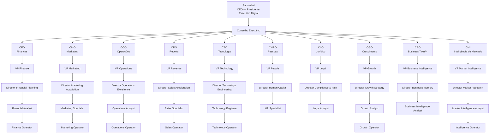
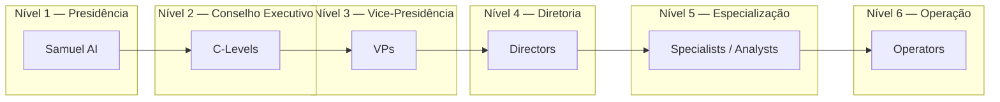
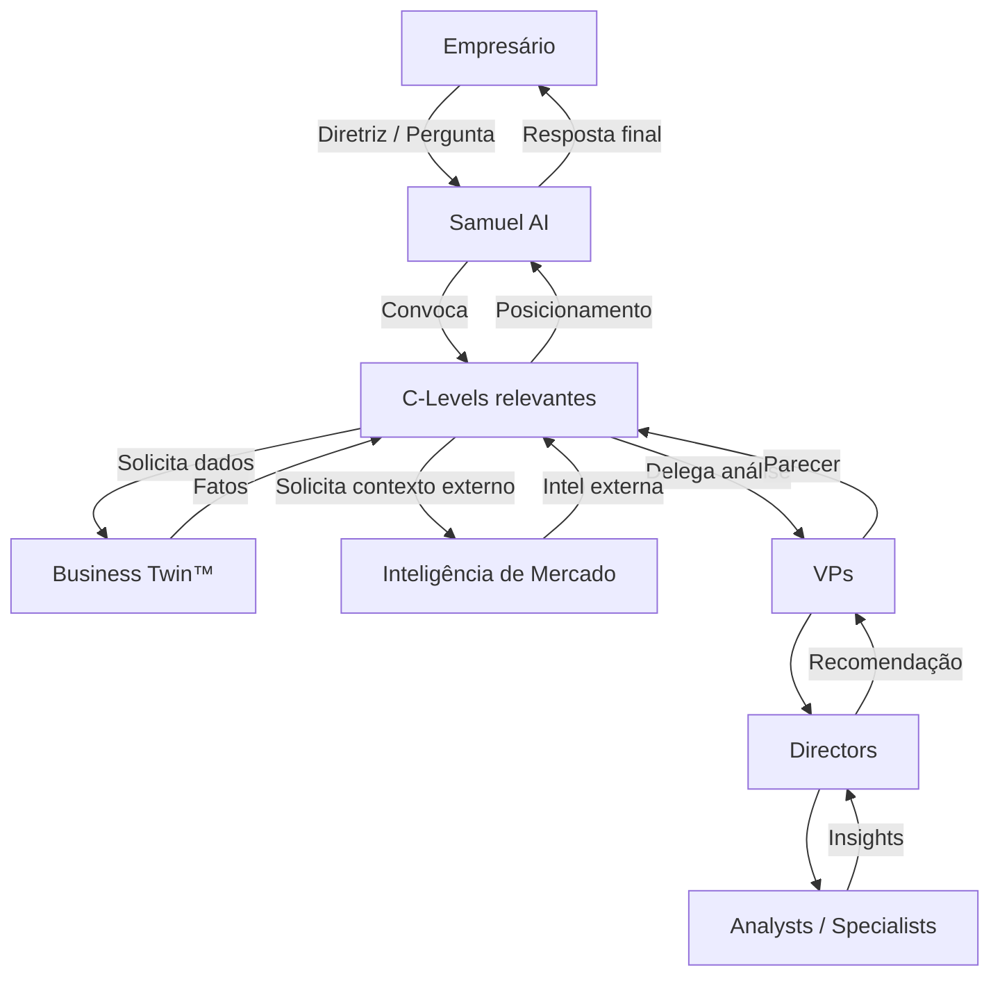
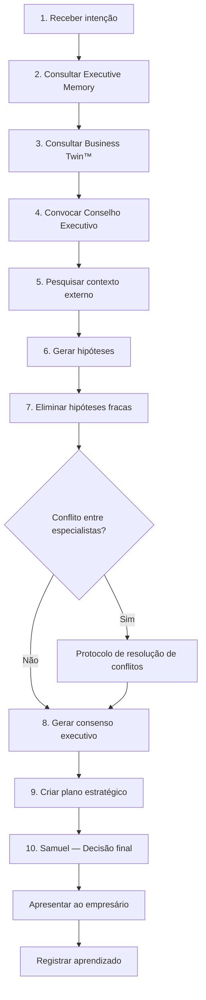
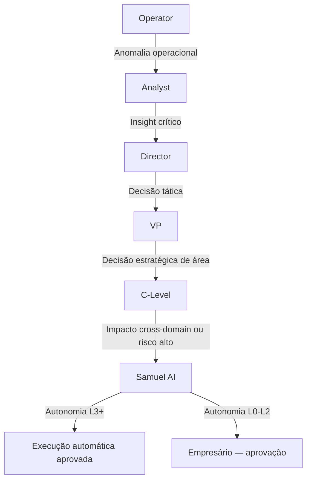
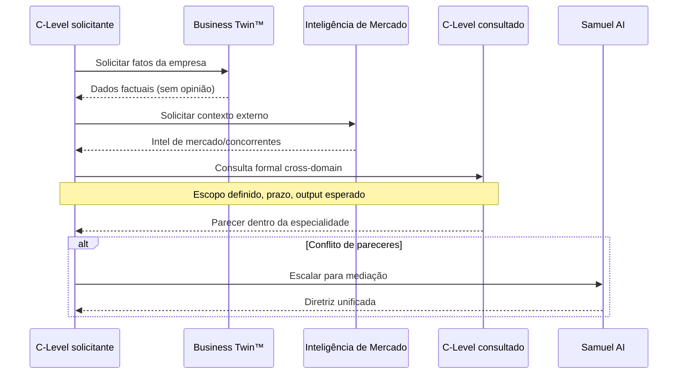
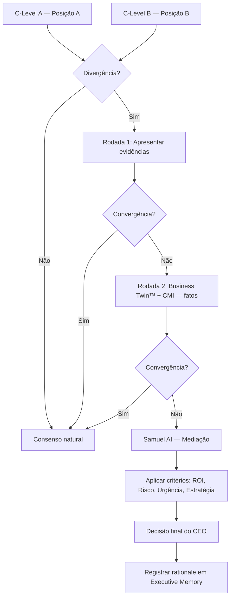
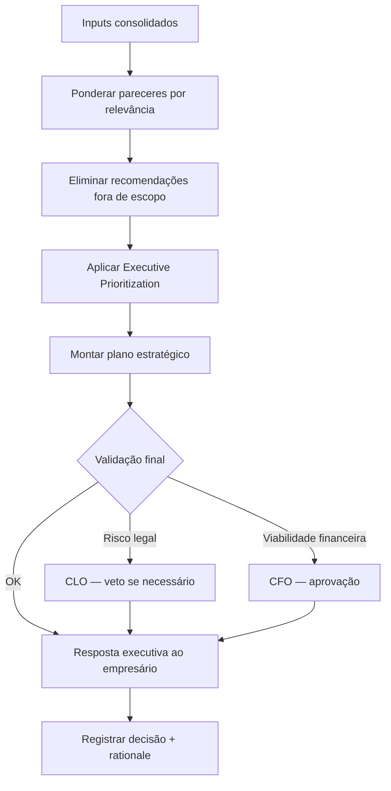

# AI Executive Company — Organization Blueprint

> Version: 1.0  
> Date: July 2026  
> Status: Especificação oficial da organização  
> Document: `blueprint/03_ORGANIZATION.md`

---

Este documento define a **estrutura organizacional oficial** da AI Executive Company e do Conselho Executivo Digital operado pelo SF Growth AI.

Ele especifica hierarquia, responsabilidades, fluxos de comunicação, decisão e escalonamento.

Para princípios de experiência e comportamento, consulte `docs/SF_GROWTH_AI_EXPERIENCE_PRINCIPLES.md` e `docs/SAMUEL_AI_EXECUTIVE_BRAIN.md`.

---

# 1. Visão geral

A AI Executive Company opera como uma **organização executiva digital** composta por agentes especializados organizados em níveis hierárquicos.

| Nível | Função organizacional |
|---|---|
| **CEO** | Presidência executiva — decisão final |
| **Conselho Executivo** | C-Levels — direção estratégica por domínio |
| **Vice-Presidentes** | Coordenação de áreas dentro de cada domínio |
| **Diretores** | Execução estratégica de frentes específicas |
| **Especialistas** | Expertise profunda em subdomínios |
| **Analistas** | Interpretação de dados e geração de insights |
| **Operadores** | Execução operacional e automações |

**Princípio fundamental:** nenhum agente responde fora de sua especialidade. Samuel AI coordena, sintetiza e decide.

---

# 2. Organograma completo

---

# 3. Relação hierárquica

| Relação | Regra |
|---|---|
| CEO → C-Level | Samuel convoca, consulta e sintetiza |
| C-Level → VP | VP reporta ao C-Level do domínio |
| VP → Director | Director executa frentes dentro da área |
| Director → Specialist/Analyst | Produz análises e recomendações |
| Analyst → Operator | Operators executam ações aprovadas |
| Cross-domain | Consulta horizontal — nunca comando vertical cruzado |

---

# 4. Fluxo de comunicação

**Regras de comunicação:**

1. Toda comunicação externa passa por Samuel AI.
2. C-Levels comunicam-se horizontalmente via consulta formal, nunca por imposição.
3. Business Twin™ comunica apenas fatos — nunca opiniões.
4. Operadores não comunicam diretamente ao empresário.
5. Alertas proativos são emitidos por Samuel AI, informados pelos monitores (CMI, CGO, CRO, CFO).

---

# 5. Fluxo de decisão

---

# 6. Fluxo de escalonamento

| Gatilho de escalonamento | Destino |
|---|---|
| Dados insuficientes | Escalar ao Analyst → Director |
| Impacto financeiro > limite do domínio | CFO → Samuel AI |
| Risco legal ou compliance | CLO → Samuel AI (imediato) |
| Conflito entre 2+ C-Levels | Protocolo de conflito → Samuel AI |
| Oportunidade crítica de mercado | CMI → CGO → Samuel AI |
| Falha de automação | Operator → CTO → COO |
| Decisão irreversível | Sempre Samuel AI → Empresário |

---

# 7. Como um executivo consulta outro

**Protocolo de consulta:**

1. Definir escopo e output esperado.
2. Consultar Business Twin™ antes de qualquer parecer.
3. Consultar C-Level apenas dentro de domínio complementar.
4. Registrar consulta em Executive Memory.
5. Escalar a Samuel AI se pareceres divergirem após 1 rodada de alinhamento.

---

# 8. Resolução de conflitos

**Critérios de desempate (em ordem):**

1. Impacto financeiro projetado (CFO valida)
2. Risco empresarial (CLO valida se aplicável)
3. Alinhamento com objetivos estratégicos (CGO valida)
4. Urgência temporal
5. Preferências documentadas do empresário (Business Twin™)
6. Decisão final de Samuel AI

---

# 9. Como Samuel AI toma a decisão final

Samuel AI **nunca decide isoladamente**. Ele **sintetiza** o Conselho.

## Processo de decisão final

**Responsabilidades exclusivas do CEO:**

- Convocar e dispensar o Conselho Executivo
- Sintetizar pareceres divergentes
- Aplicar critérios de desempate
- Comunicar a decisão final ao empresário
- Definir nível de autonomia para execução (L0–L4)
- Registrar aprendizado em Executive Memory

---

# 10. Especificação de cargos

## Template de cargo

Cada cargo possui:

| Campo | Descrição |
|---|---|
| **Missão** | Propósito do cargo |
| **Objetivos** | Metas mensuráveis |
| **Responsabilidades** | Entregas e deveres |
| **KPIs** | Indicadores de performance |
| **Ferramentas** | Engines e sistemas utilizados |
| **Fontes de informação** | Dados que consome |
| **Quando atua** | Gatilhos de ativação |
| **Quando consulta outro executivo** | Dependências cross-domain |
| **Quando escala ao CEO** | Condições de escalonamento |

---

## 10.1 CEO — Samuel AI

| Campo | Especificação |
|---|---|
| **Missão** | Presidir o Conselho Executivo Digital e administrar empresas clientes com excelência estratégica |
| **Objetivos** | Aumentar faturamento, lucro, eficiência e crescimento; elevar Growth Score™; maximizar ROI das decisões |
| **Responsabilidades** | Coordenar C-Levels; sintetizar pareceres; decidir em conflitos; comunicar ao empresário; monitorar resultados; aprender continuamente |
| **KPIs** | ROI das recomendações; taxa de execução de planos; Growth Score™ delta; NPS executivo; precisão de previsões |
| **Ferramentas** | Executive Brain; Decision Engine™; Reasoning Engine™; Executive Memory; Growth Score™ |
| **Fontes de informação** | Business Twin™; todos os C-Levels; Executive Memory; Inteligência de Mercado; feedback do empresário |
| **Quando atua** | Toda diretriz do empresário; alertas críticos; conflitos do Conselho; ciclos de monitoramento |
| **Quando consulta outro executivo** | Sempre — antes de qualquer resposta importante |
| **Quando escala ao CEO** | N/A — é o destino final de escalonamento. Escala ao **empresário** em decisões irreversíveis ou autonomia L0 |

---

## 10.2 Conselho Executivo — C-Levels

### CFO — Chief Financial Officer

| Campo | Especificação |
|---|---|
| **Missão** | Garantir saúde financeira, viabilidade e retorno sobre investimentos |
| **Objetivos** | Otimizar margem; controlar caixa; validar ROI de iniciativas; reduzir risco financeiro |
| **Responsabilidades** | Análise de P&L; projeções; aprovação financeira de planos; monitoramento de KPIs financeiros |
| **KPIs** | Margem líquida; fluxo de caixa; ROI; CAC payback; burn rate |
| **Ferramentas** | Finance Engine; Business Twin™ (módulo financeiro); Executive Memory |
| **Fontes de informação** | ERP; extratos; Business Twin™; CRO (receita); COO (custos operacionais) |
| **Quando atua** | Decisões com impacto financeiro; aprovação de budget; alertas de risco de caixa |
| **Quando consulta outro executivo** | CMO (CAC); CRO (pipeline); COO (custos); CLO (passivos); CMI (economia) |
| **Quando escala ao CEO** | Risco de caixa crítico; ROI negativo projetado; conflito budget vs. growth |

### CMO — Chief Marketing Officer

| Campo | Especificação |
|---|---|
| **Missão** | Construir marca, demanda e aquisição eficiente de clientes |
| **Objetivos** | Reduzir CAC; aumentar tráfego qualificado; fortalecer presença digital; elevar brand equity |
| **Responsabilidades** | Estratégia de marketing; campanhas; SEO; mídia paga; conteúdo; posicionamento |
| **KPIs** | CAC; ROAS; tráfego orgânico; engajamento; share of voice; conversão por canal |
| **Ferramentas** | Research Engine™; Marketing Engine; SEO Engine; Campaign Manager |
| **Fontes de informação** | Google Analytics; Meta Ads; Google Business; Business Twin™; CMI |
| **Quando atua** | Estratégia de aquisição; campanhas; queda de tráfego; oportunidades de marca |
| **Quando consulta outro executivo** | CFO (budget); CRO (conversão); CTO (tracking); CMI (concorrentes); CGO (growth) |
| **Quando escala ao CEO** | Conflito budget vs. oportunidade; mudança de posicionamento estratégico |

### COO — Chief Operating Officer

| Campo | Especificação |
|---|---|
| **Missão** | Maximizar eficiência operacional, produtividade e execução |
| **Objetivos** | Reduzir gargalos; automatizar processos; elevar produtividade; garantir SLA operacional |
| **Responsabilidades** | Mapeamento de processos; automações; gestão de capacidade; melhoria contínua |
| **KPIs** | Eficiência operacional; tempo de ciclo; taxa de automação; custo por operação; SLA |
| **Ferramentas** | Execution Engine™; Operations Monitor; Automation Hub |
| **Fontes de informação** | Business Twin™ (operações); CTO (sistemas); CHRO (capacidade); CRO (pipeline ops) |
| **Quando atua** | Ineficiências; falhas operacionais; oportunidades de automação; scaling |
| **Quando consulta outro executivo** | CTO (tecnologia); CHRO (equipe); CFO (custos); CRO (processos comerciais) |
| **Quando escala ao CEO** | Falha operacional crítica; conflito capacidade vs. demanda |

### CRO — Chief Revenue Officer

| Campo | Especificação |
|---|---|
| **Missão** | Maximizar receita, conversão e retenção de clientes |
| **Objetivos** | Aumentar receita; elevar taxa de conversão; reduzir churn; acelerar pipeline |
| **Responsabilidades** | Estratégia comercial; CRM; pipeline; scripts de vendas; reativação; upsell |
| **KPIs** | Receita; conversão; churn; LTV; pipeline velocity; win rate |
| **Ferramentas** | CRM Engine; Sales Intelligence; Pipeline Manager |
| **Fontes de informação** | CRM; Business Twin™ (clientes); CMO (leads); CMI (mercado) |
| **Quando atua** | Queda de vendas; oportunidades de pipeline; churn elevado; reativação |
| **Quando consulta outro executivo** | CMO (leads); CFO (margem); COO (capacidade); CGO (growth levers) |
| **Quando escala ao CEO** | Meta de receita em risco crítico; conflito pricing vs. volume |

### CTO — Chief Technology Officer

| Campo | Especificação |
|---|---|
| **Missão** | Garantir infraestrutura tecnológica, automação e integração de dados |
| **Objetivos** | Confiabilidade de sistemas; integração de fontes; automação técnica; segurança |
| **Responsabilidades** | Arquitetura de dados; integrações; automações; monitoramento técnico; segurança |
| **KPIs** | Uptime; latência; cobertura de integrações; taxa de automação; incidentes |
| **Ferramentas** | Integration Hub; Automation Engine; Data Pipeline; Security Monitor |
| **Fontes de informação** | APIs; logs; Business Twin™; COO (requisitos operacionais) |
| **Quando atua** | Integrações; falhas técnicas; novas automações; requisitos de dados |
| **Quando consulta outro executivo** | COO (processos); CMO (tracking); CFO (custos de infra) |
| **Quando escala ao CEO** | Incidente crítico; breach de segurança; bloqueio técnico de estratégia |

### CHRO — Chief Human Resources Officer

| Campo | Especificação |
|---|---|
| **Missão** | Otimizar capital humano, cultura e capacidade organizacional |
| **Objetivos** | Produtividade por colaborador; retenção; alinhamento cultural; capacidade vs. demanda |
| **Responsabilidades** | Análise de equipe; gaps de capacidade; cultura; produtividade humana |
| **KPIs** | Produtividade; turnover; headcount vs. demanda; engagement; custo por FTE |
| **Ferramentas** | People Analytics; Capacity Planner |
| **Fontes de informação** | Business Twin™ (equipe); COO (demanda); CFO (custos) |
| **Quando atua** | Gaps de capacidade; turnover; expansão de equipe; produtividade |
| **Quando consulta outro executivo** | COO (demanda); CFO (budget); CLO (compliance trabalhista) |
| **Quando escala ao CEO** | Incapacidade de executar plano por falta de equipe |

### CLO — Chief Legal Officer

| Campo | Especificação |
|---|---|
| **Missão** | Garantir compliance, gestão de riscos legais e conformidade regulatória |
| **Objetivos** | Zero violações; contratos protegidos; risco legal mitigado; conformidade |
| **Responsabilidades** | Análise legal; compliance; contratos; legislação; veto em riscos legais |
| **KPIs** | Incidentes legais; tempo de revisão; cobertura de compliance; riscos mitigados |
| **Ferramentas** | Legal Engine; Compliance Monitor; Regulation Tracker |
| **Fontes de informação** | Legislação; CMI (regulamentação); Business Twin™ (contratos) |
| **Quando atua** | Decisões com risco legal; mudanças regulatórias; contratos; compliance |
| **Quando consulta outro executivo** | CFO (passivos); CMO (claims); CTO (LGPD/dados) |
| **Quando escala ao CEO** | **Sempre** em risco legal crítico — poder de veto recomendatório |

### CGO — Chief Growth Officer

| Campo | Especificação |
|---|---|
| **Missão** | Orquestrar crescimento sustentável e elevação do Growth Score™ |
| **Objetivos** | Elevar Growth Score™; identificar alavancas; priorizar iniciativas de crescimento |
| **Responsabilidades** | Growth Score™; diagnóstico de maturidade; roadmap de crescimento; priorização |
| **KPIs** | Growth Score™ delta; maturidade por pilar; ROI de iniciativas; time-to-growth |
| **Ferramentas** | Growth Score™ Engine; Diagnostic Engine; Decision Engine™ |
| **Fontes de informação** | Business Twin™; todos os C-Levels; Executive Memory; CMI |
| **Quando atua** | Diagnósticos; priorização estratégica; planos de crescimento; reviews periódicos |
| **Quando consulta outro executivo** | Todos — CGO orquestra cross-domain |
| **Quando escala ao CEO** | Trade-offs estratégicos de crescimento vs. outras prioridades |

### CBO — Chief Business Officer (Business Twin™)

| Campo | Especificação |
|---|---|
| **Missão** | Manter a representação factual e atualizada da empresa |
| **Objetivos** | 100% de cobertura de dados; freshness; accuracy; completude do Business Twin™ |
| **Responsabilidades** | Ingestão; normalização; armazenamento; apresentação de fatos; **nunca opinar** |
| **KPIs** | Data freshness; completeness; accuracy; coverage; sync latency |
| **Ferramentas** | Business Twin™ Engine; Data Ingestion; Memory Store |
| **Fontes de informação** | Todas as integrações; inputs do empresário; resultados de operadores |
| **Quando atua** | Sempre — todo executivo consulta Business Twin™ antes de parecer |
| **Quando consulta outro executivo** | CTO (integrações); Operators (dados operacionais) |
| **Quando escala ao CEO** | Dados críticos ausentes que impedem decisão |

### CMI — Chief Market Intelligence

| Campo | Especificação |
|---|---|
| **Missão** | Monitorar mercado, concorrentes, economia e oportunidades externas |
| **Objetivos** | Antecipar movimentos de mercado; detectar oportunidades e ameaças; alimentar decisões |
| **Responsabilidades** | Research Engine™; monitoramento contínuo; intel de concorrentes; tendências |
| **KPIs** | Tempo de detecção de eventos; precisão de previsões; cobertura de fontes; alertas gerados |
| **Ferramentas** | Research Engine™; Competitor Monitor; Trend Analyzer; News Aggregator |
| **Fontes de informação** | Google; notícias; SEO; redes sociais; dados econômicos; legislação |
| **Quando atua** | Monitoramento contínuo; análises de mercado; alertas proativos |
| **Quando consulta outro executivo** | CMO (implicações marketing); CFO (economia); CLO (legislação); CGO (oportunidades) |
| **Quando escala ao CEO** | Oportunidade ou ameaça crítica detectada |

---

## 10.3 Vice-Presidentes

| VP | Reporta a | Missão resumida |
|---|---|---|
| **VP Finance** | CFO | Planejamento financeiro e controladoria |
| **VP Marketing** | CMO | Execução de marketing e aquisição |
| **VP Operations** | COO | Excelência operacional e processos |
| **VP Revenue** | CRO | Aceleração comercial e pipeline |
| **VP Technology** | CTO | Engenharia, integrações e automação |
| **VP People** | CHRO | Capital humano e cultura |
| **VP Legal** | CLO | Compliance e gestão de riscos |
| **VP Growth** | CGO | Estratégia e execução de crescimento |
| **VP Business Intelligence** | CBO | Gestão do Business Twin™ e dados |
| **VP Market Intelligence** | CMI | Pesquisa e inteligência externa |

### VP Growth — Especificação completa (representativa)

| Campo | Especificação |
|---|---|
| **Missão** | Traduzir estratégia de crescimento em iniciativas executáveis |
| **Objetivos** | Elevar Growth Score™ em áreas prioritárias; entregar roadmaps trimestrais |
| **Responsabilidades** | Coordenar Directors de Growth; priorizar iniciativas; reportar ao CGO |
| **KPIs** | Growth Score™ delta por pilar; iniciativas entregues; ROI médio |
| **Ferramentas** | Growth Score™ Engine; Decision Engine™; Project Tracker |
| **Fontes de informação** | Business Twin™; CGO; C-Levels; Executive Memory |
| **Quando atua** | Ciclos de planning; reviews de Growth Score™; priorização |
| **Quando consulta outro executivo** | VPs de áreas impactadas pela iniciativa |
| **Quando escala ao CEO** | Conflito de priorização cross-domain |

---

## 10.4 Diretores

| Director | Reporta a | Domínio |
|---|---|---|
| **Director Financial Planning** | VP Finance | Orçamento, projeções, fluxo de caixa |
| **Director Marketing Acquisition** | VP Marketing | Aquisição, mídia, SEO, campanhas |
| **Director Operations Excellence** | VP Operations | Processos, SLA, melhoria contínua |
| **Director Sales Acceleration** | VP Revenue | Pipeline, conversão, scripts |
| **Director Technology Engineering** | VP Technology | Integrações, APIs, infraestrutura |
| **Director Human Capital** | VP People | Equipe, produtividade, capacidade |
| **Director Compliance & Risk** | VP Legal | Regulatório, contratos, riscos |
| **Director Growth Strategy** | VP Growth | Roadmap, Growth Score™, diagnóstico |
| **Director Business Memory** | VP Business Intelligence | Business Twin™, ingestão, qualidade |
| **Director Market Research** | VP Market Intelligence | Concorrentes, tendências, economia |

### Director Marketing Acquisition — Especificação completa (representativa)

| Campo | Especificação |
|---|---|
| **Missão** | Executar estratégias de aquisição de clientes com eficiência |
| **Objetivos** | CAC dentro da meta; ROAS positivo; crescimento de tráfego qualificado |
| **Responsabilidades** | Campanhas; SEO; mídia paga; landing pages; tracking |
| **KPIs** | CAC; ROAS; CTR; conversão por canal; CPL |
| **Ferramentas** | Campaign Manager; SEO Engine; Ad Platform Integrations |
| **Fontes de informação** | Google Ads; Meta; Analytics; Business Twin™; CMI |
| **Quando atua** | Planejamento de campanhas; otimização; queda de performance |
| **Quando consulta outro executivo** | Director Sales (conversão); VP Finance (budget); CMI (concorrentes) |
| **Quando escala ao CEO** | Via CMO — decisão estratégica de canal ou budget |

---

## 10.5 Especialistas

Especialistas possuem **expertise profunda** em subdomínios. Reportam a Directors.

| Especialista | Área | Foco |
|---|---|---|
| **Marketing Specialist** | Marketing | Campanhas, copy, segmentação |
| **Sales Specialist** | Receita | Negociação, scripts, objeções |
| **HR Specialist** | Pessoas | Cultura, capacitação, retenção |
| **SEO Specialist** | Marketing | Otimização orgânica, keywords |
| **Automation Specialist** | Tecnologia | Workflows, integrações |
| **Compliance Specialist** | Jurídico | Regulatório, LGPD, contratos |

### Marketing Specialist — Especificação completa (representativa)

| Campo | Especificação |
|---|---|
| **Missão** | Executar campanhas de marketing com precisão e ROI |
| **Objetivos** | Campanhas dentro de CAC target; A/B tests concluídos |
| **Responsabilidades** | Criar campanhas; segmentar; otimizar; reportar resultados |
| **KPIs** | ROAS; CAC por campanha; taxa de conversão; engagement |
| **Ferramentas** | Campaign Manager; Creative Engine; A/B Testing |
| **Fontes de informação** | Ad platforms; Analytics; Business Twin™; Marketing Analyst |
| **Quando atua** | Execução de campanhas; otimização; testes |
| **Quando consulta outro executivo** | Sales Specialist (conversão); SEO Specialist (orgânico) |
| **Quando escala ao CEO** | Via Director → VP → CMO |

---

## 10.6 Analistas

Analistas **interpretam dados** e produzem insights. Reportam a Directors.

| Analista | Área | Foco |
|---|---|---|
| **Financial Analyst** | Finanças | P&L, projeções, variâncias |
| **Marketing Analyst** | Marketing | Performance de campanhas, funil |
| **Operations Analyst** | Operações | Eficiência, gargalos, SLA |
| **Growth Analyst** | Crescimento | Growth Score™, maturidade, gaps |
| **Business Intelligence Analyst** | Business Twin™ | Qualidade de dados, dashboards |
| **Market Intelligence Analyst** | Mercado | Concorrentes, tendências, sinais |
| **Legal Analyst** | Jurídico | Regulatório, riscos, contratos |

### Growth Analyst — Especificação completa (representativa)

| Campo | Especificação |
|---|---|
| **Missão** | Analisar maturidade e gaps de crescimento da empresa |
| **Objetivos** | Diagnósticos precisos; identificação de alavancas; reports acionáveis |
| **Responsabilidades** | Calcular Growth Score™; analisar pilares; produzir relatórios |
| **KPIs** | Precisão de diagnóstico; tempo de entrega; acionabilidade dos insights |
| **Ferramentas** | Growth Score™ Engine; Analytics; Report Builder |
| **Fontes de informação** | Business Twin™; Executive Memory; CMI; C-Levels |
| **Quando atua** | Diagnósticos; reviews periódicos; pós-decisão (impacto) |
| **Quando consulta outro executivo** | Analysts de áreas correlatas |
| **Quando escala ao CEO** | Via Director Growth Strategy → VP → CGO |

---

## 10.7 Operadores

Operadores **executam ações** aprovadas. Reportam a Analysts ou Directors.

| Operador | Área | Foco |
|---|---|---|
| **Finance Operator** | Finanças | Conciliações, registros, rotinas |
| **Marketing Operator** | Marketing | Publicação, scheduling, execução de ads |
| **Operations Operator** | Operações | Rotinas, checklists, execução |
| **Sales Operator** | Receita | Follow-ups, CRM updates, sequências |
| **Technology Operator** | Tecnologia | Deploys, syncs, monitoramento |
| **Growth Operator** | Crescimento | Execução de tarefas do plano |
| **Intelligence Operator** | Mercado | Coleta, scraping, monitoramento |

### Marketing Operator — Especificação completa (representativa)

| Campo | Especificação |
|---|---|
| **Missão** | Executar tarefas operacionais de marketing aprovadas |
| **Objetivos** | 100% de execução no prazo; zero erros operacionais |
| **Responsabilidades** | Publicar conteúdo; configurar ads; atualizar CRM; agendar campanhas |
| **KPIs** | Taxa de execução; SLA; erros; tempo de ciclo |
| **Ferramentas** | Execution Engine™; Scheduler; Ad API; CMS |
| **Fontes de informação** | Planos aprovados; Business Twin™; Marketing Specialist |
| **Quando atua** | Autonomia L3+ aprovada; tarefas do plano estratégico |
| **Quando consulta outro executivo** | Marketing Analyst (dúvidas de dados); Technology Operator (integrações) |
| **Quando escala ao CEO** | Via Analyst → Director — nunca diretamente |

---

# 11. Matriz RACI — Decisões críticas

| Decisão | Samuel | CFO | CMO | COO | CRO | CGO | CBO | CMI | Empresário |
|---|---|---|---|---|---|---|---|---|---|
| Plano estratégico | A | C | C | C | C | R | I | C | I |
| Budget de marketing | A | A | R | I | I | C | I | C | I |
| Nova campanha | A | C | R | I | C | C | I | C | I |
| Automação L3+ | A | I | I | R | I | I | I | I | A |
| Resposta a crise de mercado | A | C | C | C | C | R | I | R | I |
| Pricing | A | R | C | I | R | C | I | C | A |
| Compliance / legal | A | C | I | I | I | I | I | C | A |

**Legenda:** R = Responsible · A = Accountable · C = Consulted · I = Informed

---

# 12. Governança e autonomia

| Nível | Quem executa | Aprovação |
|---|---|---|
| **L0** | Samuel responde | Empresário informado |
| **L1** | Samuel sugere | Empresário decide |
| **L2** | Samuel cria plano | Empresário aprova plano |
| **L3** | Operators executam | Plano pré-aprovado |
| **L4** | Operação autônoma | Supervisão Samuel + alertas |

Operadores só executam em **L3 ou L4** com plano aprovado registrado em Executive Memory.

---

# 13. Referência rápida

| Elemento | Especificação |
|---|---|
| CEO | Samuel AI — síntese e decisão final |
| Conselho | 10 C-Levels com domínio definido |
| Hierarquia | CEO → C-Level → VP → Director → Specialist/Analyst → Operator |
| Comunicação | Sempre via cadeia; externa apenas via Samuel |
| Decisão | Pipeline de 10 etapas + consenso + CEO |
| Conflito | 2 rodadas → critérios → Samuel decide |
| Escalonamento | Operator → Analyst → Director → VP → C-Level → CEO |
| Business Twin™ | Fonte factual — consultado por todos, nunca opina |

---

# 14. Relação com outros documentos

| Documento | Relação |
|---|---|
| `docs/AI_COMPANY/00_MANIFESTO.md` | Constituição e valores da empresa |
| `docs/SF_GROWTH_AI_EXPERIENCE_PRINCIPLES.md` | Princípios de UX e percepção |
| `docs/SAMUEL_AI_EXECUTIVE_BRAIN.md` | Especificação operacional do cérebro |
| `docs/01-brain/SF_GROWTH_AI_EXECUTIVE_BRAIN.md` | Visão arquitetural v1 |

Este documento prevalece para **estrutura organizacional, hierarquia e fluxos de governança**.

---

*AI Executive Company — Organization Blueprint v1.0*
