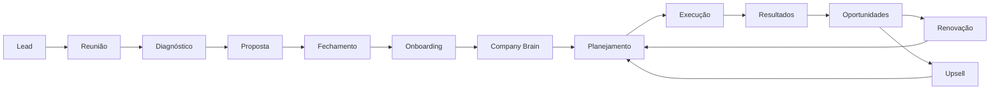

# Influence Publicidade — Master Agency Workflow

> **Épico:** 2 — Influence Operating System  
> **Sprint:** A03 — Agency Operating Model  
> **Documento:** `blueprint/lighthouse/influence/operating-model/MASTER_AGENCY_WORKFLOW.md`  
> **Status:** Modelo operacional oficial — Lighthouse  
> **Empresa:** Influence Publicidade (agência de publicidade)

---

## Objetivo

Definir o fluxo completo da operação de agência — da captura de lead à renovação de contrato — como referência para validação arquitetural do SF Growth AI e reutilização em qualquer agência da plataforma.

---

## Fluxo principal

```
Lead
  ↓
Reunião de descoberta
  ↓
Diagnóstico
  ↓
Proposta comercial
  ↓
Fechamento
  ↓
Onboarding do cliente
  ↓
Company Brain (Business Twin™)
  ↓
Planejamento estratégico
  ↓
Execução (conteúdo · mídia · social · web · software)
  ↓
Resultados e relatórios
  ↓
Novas oportunidades (upsell)
  ↓
Renovação
```

---

## Mapa de processos

| Fase | Documento | IA principal | Output principal |
|---|---|---|---|
| Lead | [01_CLIENT_ACQUISITION.md](./01_CLIENT_ACQUISITION.md) | CRO + CMO | Lead qualificado |
| Reunião | [01_CLIENT_ACQUISITION.md](./01_CLIENT_ACQUISITION.md) | CRO + CSO | Brief de descoberta |
| Diagnóstico | [03_DIAGNOSIS.md](./03_DIAGNOSIS.md) | CDO + CSO | Diagnóstico estratégico |
| Proposta | [01_CLIENT_ACQUISITION.md](./01_CLIENT_ACQUISITION.md) | CRO + CFO | Proposta comercial |
| Fechamento | [01_CLIENT_ACQUISITION.md](./01_CLIENT_ACQUISITION.md) | CRO + CLO | Contrato assinado |
| Onboarding | [02_CLIENT_ONBOARDING.md](./02_CLIENT_ONBOARDING.md) | COO + CDO | Tenant configurado |
| Company Brain | [02_CLIENT_ONBOARDING.md](./02_CLIENT_ONBOARDING.md) | Samuel AI + CDO | Business Twin™ ativo |
| Planejamento | [04_STRATEGIC_PLANNING.md](./04_STRATEGIC_PLANNING.md) | CSO + CMO | Plano estratégico trimestral |
| Execução | [05_EXECUTION.md](./05_EXECUTION.md) | COO + C-Levels | Entregáveis publicados |
| Conteúdo | [06_CONTENT_PRODUCTION.md](./06_CONTENT_PRODUCTION.md) | CMO | Peças criativas aprovadas |
| Mídia paga | [07_PAID_MEDIA.md](./07_PAID_MEDIA.md) | CMO + CDO | Campanhas otimizadas |
| Social | [08_SOCIAL_MEDIA.md](./08_SOCIAL_MEDIA.md) | CMO | Calendário editorial executado |
| Google Business | [09_GOOGLE_BUSINESS.md](./09_GOOGLE_BUSINESS.md) | CMO + CDO | Perfil local otimizado |
| Website | [10_WEBSITE_PROJECTS.md](./10_WEBSITE_PROJECTS.md) | CTO + CMO | Site publicado |
| Software Factory | [11_SOFTWARE_FACTORY_PROJECTS.md](./11_SOFTWARE_FACTORY_PROJECTS.md) | CTO + CSO | Solução implantada |
| Relatórios | [12_MONTHLY_REPORTS.md](./12_MONTHLY_REPORTS.md) | CDO + CCO | Relatório mensal |
| Client Success | [13_CLIENT_SUCCESS.md](./13_CLIENT_SUCCESS.md) | CCO | Health score do cliente |
| Renovação | [14_RENEWALS.md](./14_RENEWALS.md) | CRO + CCO | Contrato renovado |
| Upsell | [15_UPSELL.md](./15_UPSELL.md) | CRO + CSO | Nova linha de receita |
| Retenção | [16_RETENTION.md](./16_RETENTION.md) | CCO + CRO | Churn evitado |
| Offboarding | [17_OFFBOARDING.md](./17_OFFBOARDING.md) | COO + CLO | Encerramento controlado |

---

## Ciclo de valor da agência



---

## Princípios operacionais

1. **Um cliente = um tenant** — isolamento total via multi-tenant; Influence opera como agência-mãe.
2. **Company Brain antes de executar** — nenhuma campanha inicia sem Business Twin™ mínimo configurado.
3. **Samuel AI sintetiza, Conselho especializa** — CRO propõe, CFO valida margem, CMO executa.
4. **Entregáveis mensuráveis** — todo processo gera KPI rastreável no Executive Monitoring.
5. **Reutilização cross-cliente** — templates, playbooks e automações da Influence servem todos os clientes da agência.

---

## Integrações com a plataforma

| Componente SF Growth AI | Uso na Influence |
|---|---|
| Agency Platform | Workspace multi-cliente da agência |
| Multi-tenant | Tenant por cliente final |
| Company Brain | Business Twin™ por cliente |
| Executive Council | C-Levels por domínio operacional |
| Software Factory | Projetos de software sob demanda |
| Executive Memory | Histórico de decisões e aprendizados |

---

## Documentos relacionados

- [blueprint/12_AGENCY_PLATFORM.md](../../../12_AGENCY_PLATFORM.md)
- [blueprint/04_EXECUTIVE_COUNCIL.md](../../../04_EXECUTIVE_COUNCIL.md)
- [COMPANY_BRAIN.md](../../../../COMPANY_BRAIN.md)
