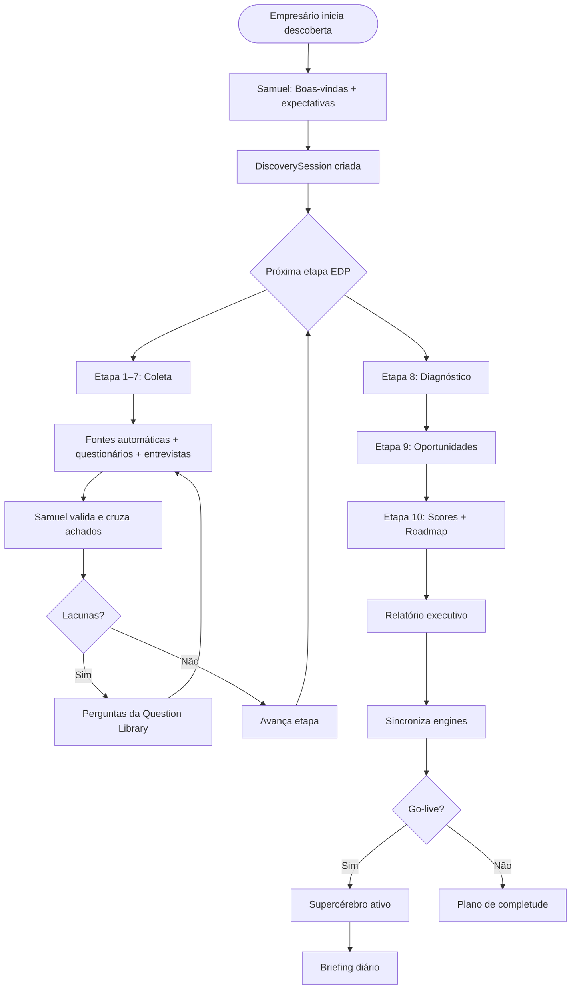

# Discovery Workflow — Como Samuel Conduz a Descoberta

> **Projeto:** Piloto G03 — Enterprise Discovery Protocol  
> **Documento:** `blueprint/methodologies/DISCOVERY_WORKFLOW.md`  
> **Versão:** 1.0 · Julho 2026

---

## Propósito

Este documento descreve **como Samuel AI conduz o Enterprise Discovery Protocol (EDP)** do início ao go-live do Supercérebro — incluindo papéis, rituais, decisões e handoffs entre camadas do SF Growth AI.

---

## Princípio de condução

> Samuel AI não é um formulário. É um **entrevistador executivo** que adapta perguntas, cruza fontes, valida respostas e sintetiza conhecimento em tempo real.

---

## Visão geral do workflow



---

## Fases do workflow

| Fase | Duração | Objetivo | Output |
|---|---|---|---|
| **0. Onboarding** | Dia 0 | Alinhar expectativas, nomear champion | DiscoverySession |
| **1. Coleta** | Dias 1–7 | Etapas 1–7 do EDP | CompanyProfile parcial |
| **2. Diagnóstico** | Dias 5–10 | Etapa 8 | Gaps + riscos |
| **3. Oportunidades** | Dias 8–12 | Etapa 9 | Pipeline de ações |
| **4. Ativação** | Dias 10–15 | Etapa 10 | Scores + roadmap + go-live |
| **5. Operação** | Dia 15+ | Briefing diário | Supercérebro em produção |

---

## Fase 0 — Onboarding (Dia 0)

### O que Samuel faz

1. **Apresenta-se** como Presidente Executivo Digital — não chatbot.
2. **Explica o EDP** em <3 minutos: 10 etapas, 5–15 dias, resultado = empresa modelada.
3. **Define expectativas:** tempo do empresário (30 min/dia), champion interno, acesso a sistemas.
4. **Cria DiscoverySession** via `CompanyDiscoveryEngine.startDiscovery()`.
5. **Publica** evento `DiscoveryStarted`.

### Script de abertura (Samuel)

> "Bom dia. Sou o Samuel AI, o seu Presidente Executivo Digital.  
> Nos próximos dias vou conhecer a sua empresa em profundidade — não para responder perguntas, mas para administrá-la com inteligência.  
> Vamos seguir o Enterprise Discovery Protocol: 10 etapas, múltiplas fontes, um objetivo — criar o Gêmeo Digital da sua empresa.  
> Preciso de 30 minutos por dia consigo e de um champion interno que me ajude com dados.  
> Podemos começar?"

### Decisões nesta fase

| Decisão | Quem decide |
|---|---|
| Fontes a ativar | Samuel recomenda · CEO aprova |
| Champion interno | CEO nomeia |
| Ritual de briefing (horário) | CEO escolhe |

---

## Fase 1 — Coleta (Etapas 1–7)

### Loop por etapa

Para cada etapa do EDP, Samuel executa:

```
1. Anunciar etapa ("Vamos falar sobre a identidade da empresa")
2. Disparar fontes automáticas (DiscoveryCoordinator)
3. Aplicar perguntas [E] da Question Library
4. Registrar DiscoveryFinding(s)
5. Atualizar CompanyProfile (BusinessProfiler)
6. Calcular confiança da etapa
7. Se confiança < 70% → perguntas [I] + pedir documentos
8. Se confiança ≥ 70% → avançar
9. Publicar BusinessProfileUpdated
```

### Papéis do Conselho na coleta

| Etapa | Especialista líder | Contribuição |
|---|---|---|
| 1 Identidade | CMO | Marca, posicionamento, mercados |
| 2 Estrutura | CHRO | Organograma, papéis, cultura |
| 3 Operação | COO | Processos, SLAs, capacidade |
| 4 Relacionamentos | CRO | Clientes, pipeline, concorrentes |
| 5 Tecnologia | CTO | Stack, integrações, segurança |
| 6 Financeiro | CFO | Receita, margem, caixa |
| 7 Marketing | CMO | Aquisição, conversão, reputação |

### Rituais durante coleta

| Ritual | Frequência | Duração | Conteúdo |
|---|---|---|---|
| **Check-in Samuel** | Diário | 5–10 min | Progresso EDP, 3 perguntas, bloqueios |
| **Validação champion** | A cada 2 dias | 15 min | Confirmar dados coletados |
| **Upload de documentos** | Sob demanda | — | ERP exports, organogramas, relatórios |

### Fontes por etapa

| Etapa | Fontes prioritárias |
|---|---|
| 1 | website, linkedin, google_business, interviews |
| 2 | employees, documents, questionnaires, interviews |
| 3 | erp, documents, employees, interviews |
| 4 | crm, erp, website, interviews |
| 5 | website, documents, employees, interviews |
| 6 | erp, documents, interviews |
| 7 | website, google_business, facebook, instagram, crm |

---

## Fase 2 — Diagnóstico (Etapa 8)

### O que Samuel faz

1. **Convoca Conselho Executivo** para deliberar sobre saúde da empresa.
2. **GapAnalyzer** identifica lacunas de dados.
3. **Samuel conduz entrevista de diagnóstico** — perguntas 203–230 da Question Library.
4. **Classifica** problemas, gargalos, riscos e fraquezas por severidade.
5. **Publica** eventos `GapDetected` para cada item crítico.

### Output apresentado ao CEO

```
📊 Diagnóstico Executivo — [Nome da Empresa]

🔴 Crítico (agir em 30 dias)
  • [Problema 1] — Impacto: €X / Recomendação: Y

🟠 Alto (agir em 90 dias)
  • [Gargalo 1] — Horas perdidas: Xh/sem

🟡 Médio (monitorizar)
  • [Risco 1] — Probabilidade: média

Top 3 fraquezas competitivas:
  1. ...
  2. ...
  3. ...
```

### Regra de ouro

> Samuel nunca apresenta diagnóstico sem dados. Se faltam dados, apresenta lacunas primeiro.

---

## Fase 3 — Oportunidades (Etapa 9)

### O que Samuel faz

1. **OpportunityDetector** cruza perfil + diagnóstico.
2. **Executive Innovation** gera hipóteses adicionais.
3. **Samuel conduz** perguntas 231–258 da Question Library.
4. **Executive Project Generator** cria business case para top 5.
5. **Publica** eventos `OpportunityDetected`.
6. **Prioriza** em Tier 1 (0–90d) / Tier 2 (90–180d) / Tier 3 (180–365d).

### Formato de oportunidade

| Campo | Exemplo |
|---|---|
| Título | Contratos de manutenção recorrente |
| Tipo | Projeto / Automação / Software / App |
| ROI estimado | 340% |
| Esforço | Baixo / Médio / Alto |
| Especialista | CRO |
| Próximo passo | Piloto com 3 clientes |

---

## Fase 4 — Ativação (Etapa 10)

### Cálculo de scores

Samuel calcula e apresenta:

| Score | Fonte de dados |
|---|---|
| Enterprise Maturity Score | Média ponderada etapas 1–9 |
| Digital Maturity | Etapa 5 (tecnologia) + Etapa 7 (marketing) |
| Automation Score | Etapa 3 (operação) + Etapa 9 (automações) |
| AI Readiness | Completude perfil + champion + cultura |
| Business Health | Etapa 6 (financeiro) + Etapa 8 (diagnóstico) |

### Executive Priorities

Samuel propõe 3 prioridades. CEO aprova via Executive Inbox.

### Roadmap 30/90/180/365

Gerado automaticamente com base em scores e oportunidades Tier 1–3.

### Decisão de go-live

| Condição | Ação |
|---|---|
| AI Readiness ≥ 40 AND completeness ≥ 60% | ✅ Go-live Supercérebro |
| AI Readiness 30–39 | ⚠️ Go-live parcial (briefing only) |
| AI Readiness < 30 | ❌ Completar etapas em falta |

### Evento final

`DiscoveryCompleted` → sincronização com Enterprise Brain, Executive Memory, Executive Knowledge.

---

## Fase 5 — Operação contínua

Após go-live, Samuel muda de **modo descoberta** para **modo administração**:

| Ritual | Horário | Conteúdo |
|---|---|---|
| **Bom dia executivo** | Diário 08h30 | Estado, 3 oportunidades, 3 riscos, próxima ação |
| **Reunião Conselho** | Semanal | Pipeline, diagnóstico atualizado |
| **Review descoberta** | Mensal | Completude Twin, novas lacunas |
| **Redescoberta** | Trimestral | Re-executar etapas com mudança >20% |

---

## Handoffs técnicos

```
EDP (metodologia)
      ↓
CompanyDiscoveryEngine (core/company-discovery/)
      ↓
CompanyProfile (Business Twin™)
      ↓
Enterprise Brain Runtime (snapshot)
      ↓
Executive Council (deliberação)
      ↓
Samuel AI (decisão + briefing)
      ↓
CEO humano (aprovação)
```

| Evento | Quando | Quem reage |
|---|---|---|
| `DiscoveryStarted` | Dia 0 | Organization Brain |
| `BusinessProfileUpdated` | Cada etapa | Executive Knowledge |
| `GapDetected` | Etapa 8 | Executive Watchers (futuro) |
| `OpportunityDetected` | Etapa 9 | Executive Innovation |
| `DiscoveryCompleted` | Go-live | Enterprise Brain, Memory |

---

## Papéis humanos no workflow

| Papel | Responsabilidade | Tempo estimado |
|---|---|---|
| **CEO / Empresário** | Validar, decidir, ritual diário | 30 min/dia × 15 dias |
| **Champion** | Dados, documentos, acesso sistemas | 2h/dia × 10 dias |
| **Heads de área** | Entrevistas específicas (1h cada) | 1–3 entrevistas |
| **TI** | Exports ERP, stack map | 2–4h total |
| **Equipa SF** | Configuração, suporte | Contínuo |

---

## Tratamento de exceções

| Situação | Ação de Samuel |
|---|---|
| CEO ausente >3 dias | Pausar EDP · notificar champion |
| Dados conflitantes entre fontes | Apresentar ambos · pedir validação |
| Confiança < 40% em etapa crítica | Não avançar · agendar entrevista |
| Resistência da equipa | Modo gradual · quick wins primeiro |
| ERP inacessível | Aceitar Excel temporário · marcar lacuna |

---

## Métricas de sucesso do workflow

| Métrica | Target |
|---|---|
| EDP concluído em | ≤15 dias (PME) |
| Perguntas [E] respondidas | 100% |
| CompanyProfile completeness | ≥60% |
| CEO satisfaction (survey) | ≥8/10 |
| Go-live Supercérebro | Dia 15±5 |

---

## Exemplo: Grafgil (Piloto G01)

| Dia | Atividade Samuel |
|---|---|
| 0 | Onboarding · DiscoveryStarted |
| 1–2 | Etapas 1–2 (identidade + estrutura) |
| 3–4 | Etapas 3–4 (operação + relacionamentos) |
| 5–6 | Etapas 5–6 (tecnologia + financeiro) |
| 7 | Etapa 7 (marketing) |
| 8–9 | Etapa 8 (diagnóstico com Ricardo Gil) |
| 10–11 | Etapa 9 (oportunidades · Tier 1 identificado) |
| 12–14 | Etapa 10 (scores + roadmap + go-live) |
| 15+ | Briefing diário · Supercérebro Hoje |

---

## Documentos relacionados

- [ENTERPRISE_DISCOVERY_PROTOCOL.md](./ENTERPRISE_DISCOVERY_PROTOCOL.md) — as 10 etapas
- [QUESTION_LIBRARY.md](./QUESTION_LIBRARY.md) — 280 perguntas
- [../discovery/DISCOVERY_METHOD.md](../discovery/DISCOVERY_METHOD.md) — implementação técnica
- [../pilots/grafgil/GRAFGIL_EXECUTIVE_ROADMAP.md](../pilots/grafgil/GRAFGIL_EXECUTIVE_ROADMAP.md) — roadmap pós-descoberta

---

> *"Samuel não preenche formulários. Samuel conduz conversas, cruza fontes e constrói o Gêmeo Digital da empresa."*  
> — Discovery Workflow, SF Growth AI
