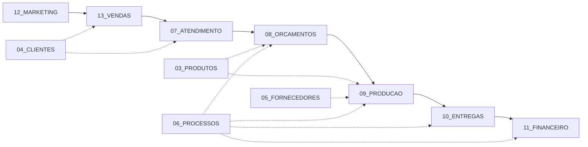
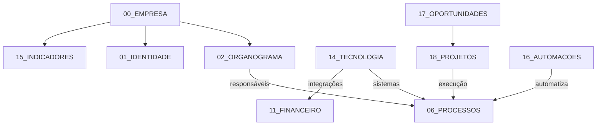

# Grafgil Digital Twin — Master Map

> **Documento:** `blueprint/pilots/grafgil/MASTER_MAP.md`  
> **Piloto:** G01 — Grafgil Digital Twin  
> **Versão:** 1.0 · Julho 2026

---

## O que é este mapa

O **Master Map** é a visão sistémica do Gêmeo Digital da Grafgil. Mostra como as 20 áreas do Twin se relacionam entre si e como o Supercérebro atua em cada uma.

```
                    ┌─────────────────────────────────┐
                    │      19_SUPERCEREBRO.md         │
                    │   Samuel AI + Conselho Executivo │
                    └───────────────┬─────────────────┘
                                    │
                    ┌───────────────▼─────────────────┐
                    │       00_EMPRESA.md (raiz)       │
                    │         Business Twin™           │
                    └───────────────┬─────────────────┘
                                    │
        ┌───────────┬───────────┬───┴───┬───────────┬───────────┐
        ▼           ▼           ▼       ▼           ▼           ▼
   IDENTIDADE  ORGANOGRAMA  PRODUTOS CLIENTES FORNECEDORES PROCESSOS
   (01)        (02)         (03)     (04)    (05)         (06)
        │           │           │       │           │           │
        └─────┬─────┴─────┬─────┴───┬───┴─────┬─────┴─────┬─────┘
              ▼           ▼         ▼         ▼           ▼
         ATENDIMENTO ORÇAMENTOS PRODUÇÃO ENTREGAS  FINANCEIRO
            (07)        (08)      (09)     (10)      (11)
              │           │         │         │           │
              └─────┬─────┴─────┬───┴─────┬───┴─────┬─────┘
                    ▼           ▼         ▼         ▼
               MARKETING    VENDAS  TECNOLOGIA INDICADORES
                 (12)        (13)      (14)       (15)
                    │           │         │           │
                    └─────┬─────┴─────┬───┴─────┬─────┘
                          ▼           ▼         ▼
                     AUTOMACOES OPORTUNIDADES PROJETOS
                       (16)        (17)       (18)
```

---

## Mapa de relações entre áreas

### Fluxo principal: Order-to-Cash



### Fluxo de suporte



---

## Matriz área × Supercérebro

| Área | Documento | Especialista | Engine principal | Ritual |
|---|---|---|---|---|
| Empresa | 00 | CBO | Enterprise Brain Runtime | Snapshot diário |
| Identidade | 01 | CMO | Executive Knowledge | Review trimestral |
| Organograma | 02 | CHRO | Executive Memory | Onboarding |
| Produtos | 03 | COO + CRO | Executive Knowledge | Validação margem |
| Clientes | 04 | CRO | Executive Memory | Scoring + churn |
| Fornecedores | 05 | COO | Executive Watchers | Scorecard trimestral |
| Processos | 06 | COO | Executive Orchestrator | Mapeamento contínuo |
| Atendimento | 07 | CRO | Executive Watchers | SLA diário |
| Orçamentos | 08 | CRO + CFO | Executive Inbox | Follow-up automático |
| Produção | 09 | COO | Enterprise Brain Runtime | Review semanal |
| Entregas | 10 | COO | Executive Watchers | Tracking instalação |
| Financeiro | 11 | CFO | Enterprise Brain Runtime | Review mensal |
| Marketing | 12 | CMO | Executive Innovation | Calendário editorial |
| Vendas | 13 | CRO | Executive Orchestrator | Pipeline semanal |
| Tecnologia | 14 | CTO | Executive Knowledge | Roadmap trimestral |
| Indicadores | 15 | CBO | Enterprise Brain Runtime | Briefing diário |
| Automações | 16 | CTO + COO | Executive Watchers | Deploy faseado |
| Oportunidades | 17 | CGO | Executive Innovation | 3/dia no briefing |
| Projetos | 18 | Todos | Project Generator | Review quinzenal |
| Supercérebro | 19 | Samuel AI | Todos | Ritual diário 08h30 |

---

## Fluxo de dados no Gêmeo Digital

```
FONTES EXTERNAS                    BUSINESS TWIN™ (Grafgil)
┌──────────────┐                   ┌──────────────────────┐
│ PHC (ERP)    │───futuro────────▶│ 00–18 documentos      │
│ Website      │───futuro────────▶│ Dados estruturados    │
│ Email        │───futuro────────▶│ Regras de negócio     │
│ Excel        │───manual────────▶│ Responsáveis          │
│ WhatsApp     │───futuro────────▶│ Indicadores           │
└──────────────┘                   └──────────┬───────────┘
                                              │
                                   ┌──────────▼───────────┐
                                   │ ENTERPRISE BRAIN      │
                                   │ RUNTIME               │
                                   │ (Snapshot unificado)  │
                                   └──────────┬───────────┘
                                              │
                          ┌───────────────────┼───────────────────┐
                          ▼                   ▼                   ▼
                   ┌─────────────┐   ┌─────────────┐   ┌─────────────┐
                   │ EXECUTIVE   │   │ EXECUTIVE   │   │ EXECUTIVE   │
                   │ ORCHESTRATOR│   │ COUNCIL     │   │ WATCHERS    │
                   └──────┬──────┘   └──────┬──────┘   └──────┬──────┘
                          │                 │                   │
                          └────────┬────────┴───────────────────┘
                                   ▼
                          ┌─────────────────┐
                          │ SAMUEL AI (CEO)  │
                          │ Briefing · Ação  │
                          │ Recomendação     │
                          └────────┬────────┘
                                   ▼
                          ┌─────────────────┐
                          │ RICARDO GIL      │
                          │ (CEO humano)     │
                          │ Aprova · Decide  │
                          └─────────────────┘
```

---

## Dependências críticas entre áreas

| De | Para | Dependência |
|---|---|---|
| 04_CLIENTES | 08_ORCAMENTOS | Histórico e preferências do cliente |
| 03_PRODUTOS | 08_ORCAMENTOS | Pricing, specs, margem mínima |
| 08_ORCAMENTOS | 09_PRODUCAO | Specs e prazo confirmados |
| 05_FORNECEDORES | 09_PRODUCAO | Materiais e lead times |
| 09_PRODUCAO | 10_ENTREGAS | Job concluído libera expedição |
| 10_ENTREGAS | 11_FINANCEIRO | Conclusão dispara faturação |
| 06_PROCESSOS | Todas | SOPs e SLAs transversais |
| 15_INDICADORES | Todas | KPIs alimentados por cada área |
| 14_TECNOLOGIA | Todas | Sistemas e integrações futuras |
| 17_OPORTUNIDADES | 18_PROJETOS | Oportunidade aprovada vira projeto |
| 16_AUTOMACOES | 06_PROCESSOS | Automações implementam processos |
| 19_SUPERCEREBRO | Todas | Orquestra, monitoriza, recomenda |

---

## Ciclo de vida do Twin

| Fase | Prazo | Estado | Documentos prioritários |
|---|---|---|---|
| **1. Documentação** | Agora | Estrutura criada (esta sprint) | 00–19 + MASTER_MAP |
| **2. População** | 0–30 dias | Dados manuais inseridos | 00, 03, 04, 05, 11, 15 |
| **3. Ativação** | 30–90 dias | Supercérebro com dados reais | 19, 16, 08, 13 |
| **4. Integração** | 90–180 dias | PHC + email + website | 14, 06, 09, 10 |
| **5. Automação** | 180–365 dias | 12 automações ativas | 16, 17, 18 |
| **6. Twin vivo** | 365 dias | Tempo real, self-learning | Todos |

---

## Experiência do empresário (<5 minutos)

O Master Map orienta a Demo Experience "Supercérebro Hoje":

| Passo | Área do Twin | O que o CEO vê |
|---|---|---|
| 1 | 00_EMPRESA + 15_INDICADORES | Bom dia executivo + estado geral |
| 2 | 17_OPORTUNIDADES | 3 oportunidades detectadas |
| 3 | 11_FINANCEIRO + 04_CLIENTES | 3 riscos detectados |
| 4 | 19_SUPERCEREBRO | Conselho Executivo convocado |
| 5 | 02_ORGANOGRAMA | Especialistas participantes |
| 6 | 19_SUPERCEREBRO | Consenso executivo |
| 7 | 18_PROJETOS | Projeto recomendado |
| 8 | 11_FINANCEIRO | ROI estimado |
| 9 | 19_SUPERCEREBRO | Próxima ação sugerida |

---

## Documentação relacionada

| Tipo | Localização |
|---|---|
| Enterprise Blueprint (estudo de negócio) | `00_OVERVIEW.md` – `16_SUPERBRAIN_ACTION_PLAN.md` |
| Digital Twin (modelo operacional) | `00_EMPRESA.md` – `19_SUPERCEREBRO.md` |
| Roadmap executivo | `GRAFGIL_EXECUTIVE_ROADMAP.md` |
| Arquitetura SF Growth AI | `blueprint/04_ENTERPRISE_BRAIN.md` |
| Executive Brain spec | `docs/SAMUEL_AI_EXECUTIVE_BRAIN.md` |

---

> *O Gêmeo Digital da Grafgil não é um documento — é o modelo vivo de como a empresa funciona. O Supercérebro é o sistema nervoso que o torna inteligente.*
