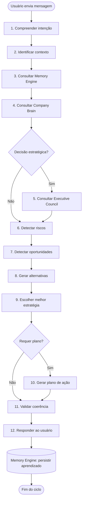
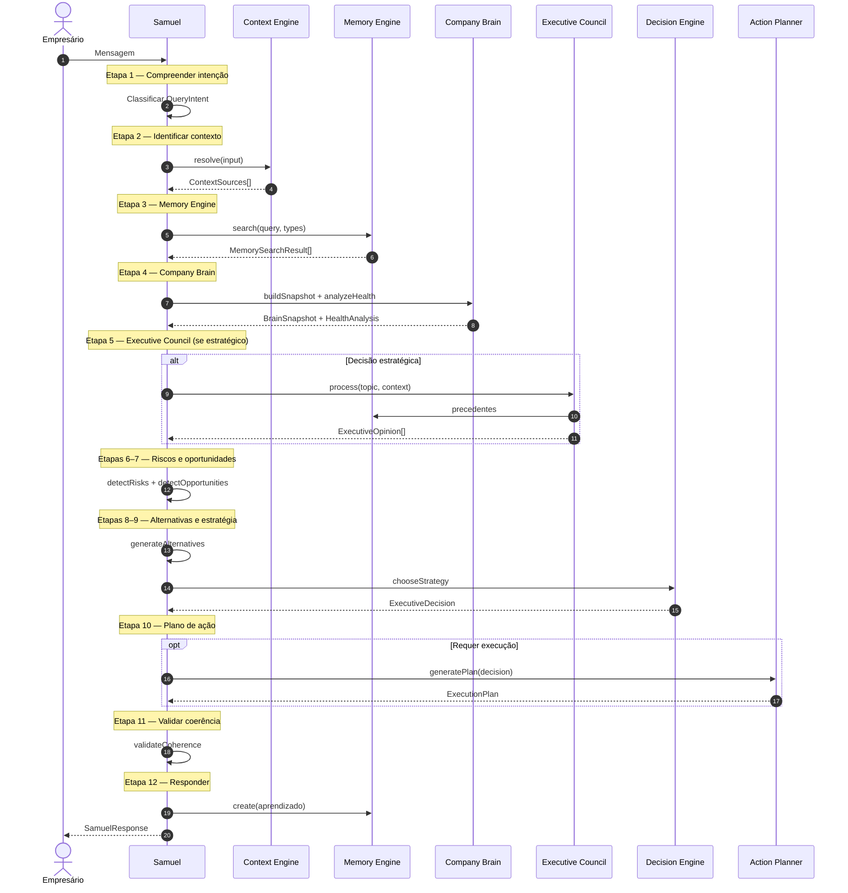

# Samuel Cognitive Framework

Version: 1.0  
Date: July 2026

---

## Objetivo

Este documento define **como o Samuel pensa antes de responder**. Não descreve implementação de IA, LLM ou OpenAI — define o **pipeline cognitivo oficial** que o Samuel Orchestrator deve seguir em toda interação.

O Samuel **nunca responde imediatamente**. Toda resposta passa por 12 etapas de raciocínio estruturado.

---

## Princípios

1. **Intenção antes de resposta** — Entender o que o usuário realmente quer, não apenas o que disse.
2. **Contexto antes de opinião** — Nenhuma recomendação sem dados da empresa.
3. **Memória antes de repetir** — Consultar o que já foi discutido, decidido ou executado.
4. **Conselho antes de decisão estratégica** — Assuntos complexos passam pelo Executive Council.
5. **Plano antes de execução** — Toda ação concreta gera um plano estruturado.
6. **Coerência antes de entrega** — Validar consistência antes de falar com o empresário.
7. **Aprendizado após resposta** — Persistir aprendizado no Memory Engine.

---

## Visão do pipeline

---

# Etapas do raciocínio

---

## Etapa 1 — Compreender a intenção do usuário

### Objetivo

Determinar o que o empresário **realmente** quer resolver — a intenção subjacente, não apenas as palavras literais.

### Entradas

| Input | Descrição |
|-------|-----------|
| `userQuery` | Texto bruto da mensagem |
| `sessionHistory` | Mensagens anteriores da conversa |
| `userProfile` | Perfil e papel do usuário na empresa |

### Saídas

| Output | Descrição |
|--------|-----------|
| `QueryIntent` | Intenção classificada (sales, marketing, growth, finance, operations, strategy, software, analysis, general) |
| `IntentConfidence` | Nível de confiança na classificação (0–100) |
| `ClarificationNeeded` | Flag se precisa pedir esclarecimento |

### Regras

- Se confiança < 60%, marcar `ClarificationNeeded = true` e preparar pergunta estratégica.
- Mapear verbos de ação: "vender" → sales, "criar" → software/execution, "analisar" → analysis.
- Considerar histórico da sessão para desambiguar ("quero mais" após discussão de marketing → marketing).
- Nunca assumir intenção sem evidência mínima.

### Dependências

- Samuel Orchestrator (`executive-conversation-orchestrator.service.ts`)
- Nenhum engine externo nesta etapa

---

## Etapa 2 — Identificar contexto

### Objetivo

Determinar quais fontes de dados e qual escopo temporal são necessários para responder com precisão.

### Entradas

| Input | Descrição |
|-------|-----------|
| `QueryIntent` | Intenção da etapa 1 |
| `tenantId` / `companyId` | Escopo multi-tenant |
| `userQuery` | Query original |

### Saídas

| Output | Descrição |
|--------|-----------|
| `ContextInput` | Parâmetros para o Context Engine |
| `ContextSources[]` | Fontes a consultar (MEMORY, FINANCIAL, MARKETING, etc.) |
| `ContextScope` | Escopo temporal (recent, quarter, all-time) |

### Regras

- Usar `Context Engine.resolve()` para inferir fontes a partir da query.
- Intenção `sales` → CLIENTS, FINANCIAL, MARKETING, CONVERSATIONS.
- Intenção `software` → PROJECTS, DOCUMENTS, COMPANY_BRAIN.
- Intenção `analysis` → todas as fontes principais.
- Limitar fragmentos iniciais a 50; expandir se confiança baixa.

### Dependências

- Context Engine (`apps/web/src/core/context/`)

---

## Etapa 3 — Consultar Memory Engine

### Objetivo

Recuperar conhecimento histórico da empresa: conversas anteriores, decisões passadas, campanhas, resultados e aprendizados.

### Entradas

| Input | Descrição |
|-------|-----------|
| `MemorySearch` | query, memoryTypes, tags, importance |
| `tenantId` / `companyId` | Escopo |

### Saídas

| Output | Descrição |
|--------|-----------|
| `MemorySearchResult[]` | Memórias ranqueadas por relevância |
| `MemorySummary` | Visão agregada do conhecimento |
| `Precedents[]` | Decisões ou ações anteriores relacionadas |

### Regras

- Buscar por query textual + tipos relevantes à intenção.
- Priorizar memórias CRITICAL e HIGH.
- Se existir precedente similar, referenciá-lo no raciocínio (não repetir erro).
- Registrar gap se nenhuma memória relevante for encontrada.

### Dependências

- Memory Engine (`apps/web/src/core/memory/`)

---

## Etapa 4 — Consultar Company Brain

### Objetivo

Obter snapshot atual da empresa: perfil, serviços, clientes, posicionamento, metas, concorrentes e saúde do negócio.

### Entradas

| Input | Descrição |
|-------|-----------|
| `organizationId` / `companyId` | Escopo |
| `QueryIntent` | Para filtrar dimensões relevantes |

### Saídas

| Output | Descrição |
|--------|-----------|
| `BrainSnapshot` | Estado completo (Business Twin) |
| `BrainContext` | Contexto estruturado |
| `HealthAnalysis` | Saúde por dimensão (marca, vendas, digital, etc.) |
| `BusinessDNA` | Missão, valores, tom de voz, promessa |

### Regras

- Business Twin é fonte de verdade para fatos internos.
- Business DNA informa tom e personalidade da resposta.
- Se snapshot desatualizado (> 30 dias), sinalizar necessidade de refresh.
- Cruzar HealthAnalysis com intenção (ex.: sales → dimensão vendas).

### Dependências

- Company Brain (`core/enterprise-brain-runtime/`)
- Context Engine (fonte COMPANY_BRAIN)

---

## Etapa 5 — Consultar Executive Council

### Objetivo

Obter pareceres de múltiplos executivos digitais quando a decisão é estratégica, complexa ou impacta mais de uma área.

### Entradas

| Input | Descrição |
|-------|-----------|
| `ProcessCouncilInput` | Tópico, contexto, executivos convocados |
| `ContextOutput` | Contexto montado nas etapas 2–4 |
| `Memory[]` | Precedentes |

### Saídas

| Output | Descrição |
|--------|-----------|
| `ProcessCouncilResult` | Decisão consensual ou conflito documentado |
| `ExecutiveOpinion[]` | Parecer individual por área (CMO, CFO, COO, etc.) |
| `CouncilConfidence` | Nível de consenso |

### Regras

- Acionar Conselho quando: intenção = strategy, impacto cross-departamental, ou confiança interna < 70%.
- Convidar executivos por área afetada (marketing → CMO, financeiro → CFO).
- Se conflito detectado, documentar ambos os lados — não omitir divergência.
- Pular etapa se intenção = general ou operação trivial.

### Dependências

- Executive Council Engine (`core/executive-council/`)

---

## Etapa 6 — Detectar riscos

### Objetivo

Identificar ameaças, fraquezas e cenários negativos que podem impedir o sucesso da ação proposta.

### Entradas

| Input | Descrição |
|-------|-----------|
| `BrainSnapshot` | Estado da empresa |
| `HealthAnalysis` | Dimensões fracas |
| `Memory[]` | Falhas anteriores |
| `ExecutiveOpinion[]` | Riscos apontados pelo Conselho |

### Saídas

| Output | Descrição |
|--------|-----------|
| `Risk[]` | Lista de riscos com severidade (Critical, High, Medium, Low) |
| `RiskSummary` | Síntese dos riscos principais |

### Regras

- Extrair riscos de fraquezas no HealthAnalysis.
- Verificar memórias de tipo ASSESSMENT e FINANCIAL com outcome negativo.
- Classificar severidade por impacto × probabilidade.
- Mínimo 0 riscos; máximo 5 na resposta final (priorizar por severidade).

### Dependências

- Company Brain
- Memory Engine
- Executive Council (quando acionado)

---

## Etapa 7 — Detectar oportunidades

### Objetivo

Identificar gaps de crescimento, quick wins e potenciais de melhoria com base nos dados coletados.

### Entradas

| Input | Descrição |
|-------|-----------|
| `BrainSnapshot` | Estado da empresa |
| `HealthAnalysis` | Dimensões com gap |
| `Memory[]` | Oportunidades anteriores não executadas |
| `ExecutiveOpinion[]` | Oportunidades apontadas pelo Conselho |

### Saídas

| Output | Descrição |
|--------|-----------|
| `Opportunity[]` | Oportunidades com potencial estimado |
| `QuickWin[]` | Ações de baixo esforço e alto impacto |
| `OpportunitySummary` | Síntese das melhores oportunidades |

### Regras

- Comparar estado atual vs. metas declaradas no Business Twin.
- Identificar quick wins: esforço ≤ 7 dias, impacto mensurável.
- Descartar oportunidades já executadas (verificar Memory Engine).
- Priorizar oportunidades alinhadas à intenção do usuário.

### Dependências

- Company Brain
- Memory Engine
- Executive Council (quando acionado)

---

## Etapa 8 — Gerar alternativas

### Objetivo

Produzir múltiplas estratégias ou caminhos possíveis — nunca apresentar apenas uma opção sem considerar alternativas.

### Entradas

| Input | Descrição |
|-------|-----------|
| `QueryIntent` | Intenção do usuário |
| `Risk[]` | Riscos identificados |
| `Opportunity[]` | Oportunidades identificadas |
| `BrainSnapshot` | Capacidade e recursos da empresa |
| `ExecutiveOpinion[]` | Sugestões do Conselho |

### Saídas

| Output | Descrição |
|--------|-----------|
| `Alternative[]` | 2–4 alternativas estratégicas |
| `AlternativeComparison` | Comparativo por esforço, impacto, risco, prazo |

### Regras

- Gerar no mínimo 2 alternativas; ideal 3.
- Cada alternativa deve ter: título, descrição, esforço, impacto esperado, riscos associados.
- Incluir sempre uma alternativa conservadora e uma agressiva.
- Descartar alternativas incompatíveis com capacidade operacional (BrainSnapshot).

### Dependências

- Etapas 6 e 7 (riscos e oportunidades)
- Decision Engine (regras de priorização)

---

## Etapa 9 — Escolher a melhor estratégia

### Objetivo

Selecionar a alternativa ótima com base em prioridade, impacto, viabilidade e alinhamento com o objetivo do empresário.

### Entradas

| Input | Descrição |
|-------|-----------|
| `Alternative[]` | Alternativas geradas |
| `QueryIntent` | Intenção original |
| `Risk[]` | Riscos por alternativa |
| `ExecutiveOpinion[]` | Consenso ou divergência do Conselho |

### Saídas

| Output | Descrição |
|--------|-----------|
| `ExecutiveDecision` | Decisão escolhida com prioridade, impacto, ROI, prazo |
| `DecisionRationale` | Justificativa da escolha |
| `RejectedAlternatives[]` | Alternativas descartadas e por quê |

### Regras

- Usar Decision Engine para scoring: prioridade × impacto ÷ risco.
- Preferir quick wins quando intenção = growth e empresa tem score < 700.
- Preferir estratégia conservadora quando riscos CRITICAL > 0.
- Documentar rationale — o empresário deve entender **por que** esta estratégia.

### Dependências

- Decision Engine (`executive-decision.service.ts`)
- Executive Council (quando acionado)

---

## Etapa 10 — Gerar plano de ação

### Objetivo

Transformar a estratégia escolhida em plano executável com fases, etapas, responsáveis e prazos.

### Entradas

| Input | Descrição |
|-------|-----------|
| `ExecutiveDecision` | Decisão da etapa 9 |
| `BrainSnapshot` | Capacidade operacional |
| `QueryIntent` | Para adaptar estrutura do plano |

### Saídas

| Output | Descrição |
|--------|-----------|
| `ExecutionPlan` | Plano com fases, steps, milestones |
| `ExecutionStep[]` | Etapas com responsável e deadline |
| `SoftwareRequest` | Requisição ao Software Factory (se aplicável) |

### Regras

- Acionar Action Planner Engine para decompor decisão em fases.
- Pular etapa se intenção = general ou resposta puramente informativa.
- Se decisão envolve software (site, landing page, app) → gerar `SoftwareRequest`.
- Plano deve ter indicadores de sucesso mensuráveis.
- Prazo total não pode exceder capacidade operacional declarada.

### Dependências

- Action Planner Engine (`executive-execution-planner.service.ts`)
- Software Factory (quando aplicável)

---

## Etapa 11 — Validar coerência

### Objetivo

Verificar consistência interna do raciocínio antes de entregar ao empresário — detectar contradições, gaps ou recomendações desalinhadas.

### Entradas

| Input | Descrição |
|-------|-----------|
| `ExecutiveDecision` | Decisão escolhida |
| `ExecutionPlan` | Plano gerado (se houver) |
| `Risk[]` | Riscos identificados |
| `BrainSnapshot` | Estado real da empresa |
| `Memory[]` | Precedentes |

### Saídas

| Output | Descrição |
|--------|-----------|
| `CoherenceReport` | Pass/Fail com lista de inconsistências |
| `AdjustedDecision` | Decisão corrigida (se necessário) |
| `ConfidenceScore` | Confiança final (0–100) |

### Regras

- Verificar se decisão contradiz Business DNA ou valores declarados.
- Verificar se plano é executável com recursos atuais.
- Verificar se recomendação repete ação já executada sem resultado (Memory).
- Se `CoherenceReport = Fail`, voltar à etapa 8 ou 9 (máximo 1 retry).
- Confiança final < 50% → incluir ressalvas explícitas na resposta.

### Dependências

- Todas as etapas anteriores
- Memory Engine (validação de precedentes)

---

## Etapa 12 — Responder ao usuário

### Objetivo

Sintetizar todo o raciocínio em resposta clara, acionável e alinhada ao tom do Business DNA — e persistir aprendizado.

### Entradas

| Input | Descrição |
|-------|-----------|
| `ExecutiveDecision` | Decisão final |
| `ExecutionPlan` | Plano (se houver) |
| `RiskSummary` | Riscos principais |
| `OpportunitySummary` | Oportunidades |
| `CoherenceReport` | Validação |
| `BusinessDNA` | Tom de voz |

### Saídas

| Output | Descrição |
|--------|-----------|
| `SamuelResponse` | Resposta estruturada ao empresário |
| `MemoryInput` | Aprendizado a persistir |
| `OrchestratorSnapshot` | Snapshot do pipeline para auditoria |

### Regras

- Resposta deve conter: diagnóstico, recomendação, próximo passo concreto.
- Usar tom do Business DNA (formal, direto, consultivo, etc.).
- Nunca expor pipeline interno ao usuário — apenas síntese executiva.
- Persistir no Memory Engine: decisão, plano, query, outcome esperado.
- Tipo de memória: CONVERSATION + STRATEGY (ou tipo relevante).

### Dependências

- Memory Engine (persistência)
- Samuel Orchestrator (entrega)

---

# Diagrama — Fluxo completo do pensamento

---

# Exemplos de raciocínio

---

## Exemplo 1 — "Quero vender mais."

### Etapa 1 — Compreender intenção

| Campo | Valor |
|-------|-------|
| Query | "Quero vender mais." |
| QueryIntent | `sales` |
| IntentConfidence | 85 |
| ClarificationNeeded | false |

**Raciocínio interno:** Verbo "vender" mapeia diretamente para intenção de vendas. Objetivo subjacente: aumentar receita e volume de clientes.

---

### Etapa 2 — Identificar contexto

| Campo | Valor |
|-------|-------|
| ContextSources | CLIENTS, FINANCIAL, MARKETING, CONVERSATIONS, CRM |
| ContextScope | recent (últimos 90 dias) |

---

### Etapa 3 — Consultar Memory Engine

| Resultado | Detalhe |
|-----------|---------|
| Memória encontrada | CONVERSATION — "Discussão sobre queda de vendas em maio" |
| Memória encontrada | MARKETING — "Campanha Meta pausada por budget" |
| Memória encontrada | FINANCIAL — "Receita −12% vs meta R$ 55.000" |
| Precedente | Retargeting sugerido em 15/06, não executado |

---

### Etapa 4 — Consultar Company Brain

| Campo | Valor |
|-------|-------|
| Clientes ativos | 340 |
| Clientes inativos elegíveis | 340 |
| Receita mensal | R$ 48.400 (−12% vs meta) |
| Investimento em ads | R$ 0 desde 12/05 |
| HealthAnalysis — Vendas | Gap: −18% tráfego orgânico |
| HealthAnalysis — Marketing | Score: 42% da capacidade |

---

### Etapa 5 — Consultar Executive Council

**Acionado:** Sim (impacto cross-departamental)

| Executivo | Opinião |
|-----------|---------|
| Sophia (CMO) | Gap de aquisição digital explica 60% da queda |
| Victor (CFO) | Budget de R$ 800/mês para retargeting é viável |
| Lucas (COO) | Operação absorve +20% de demanda sem contratação |

**CouncilConfidence:** 78% (consenso parcial — CMO e CFO alinhados)

---

### Etapa 6 — Detectar riscos

| Risco | Severidade |
|-------|------------|
| Concorrentes intensificaram presença digital (45 dias) | High |
| Base inativa sem reativação perde valor a cada mês | Medium |
| Dependência de canal único (orgânico) | Medium |

---

### Etapa 7 — Detectar oportunidades

| Oportunidade | Tipo |
|--------------|------|
| Reativar 340 clientes inativos via retargeting | Quick Win |
| Google Business Profile — presença local | Quick Win |
| Campanha Meta retargeting R$ 800/mês | Médio prazo |

---

### Etapa 8 — Gerar alternativas

| # | Alternativa | Esforço | Impacto |
|---|-------------|---------|---------|
| A | Retargeting Meta + reativação base inativa | 7 dias | Alto |
| B | Foco exclusivo em Google Business Profile | 3 dias | Médio |
| C | Contratar SDR para prospecção ativa | 30 dias | Alto (risco operacional) |

---

### Etapa 9 — Escolher melhor estratégia

**Decisão escolhida:** Alternativa A — Retargeting + reativação

| Campo | Valor |
|-------|-------|
| Prioridade | Critical |
| Impacto | Vendas |
| ROI estimado | 12–22% em 90 dias |
| Rationale | Quick win com budget aprovado pelo CFO; precedente não executado; operação pronta |

---

### Etapa 10 — Gerar plano de ação

**ExecutionPlan:**

| Fase | Steps | Prazo |
|------|-------|-------|
| 1. Preparação | Segmentar base inativa, criativos retargeting | 3 dias |
| 2. Execução | Ativar campanha Meta R$ 800/mês | 2 dias |
| 3. Monitoramento | Acompanhar CPA e reativações | 21 dias |

**Responsável:** Sophia (CMO) + Lucas (Comercial)

---

### Etapa 11 — Validar coerência

| Verificação | Resultado |
|-------------|-----------|
| Alinhado com Business DNA | Pass |
| Executável com recursos atuais | Pass |
| Não repete ação já executada | Pass (retargeting nunca foi ativado) |
| **ConfidenceScore** | **82** |

---

### Etapa 12 — Responder ao usuário

**SamuelResponse (síntese):**

> Identifiquei que sua queda de vendas (−12%) está ligada principalmente à pausa das campanhas digitais desde maio e à base de 340 clientes inativos sem reativação.
>
> **Recomendação:** Ativar retargeting Meta com budget de R$ 800/mês e campanha de reativação da base inativa.
>
> **Próximo passo:** Aprovar o plano de 3 fases (26 dias) para Sophia iniciar a segmentação esta semana.
>
> **Risco principal:** Concorrentes locais intensificaram presença digital — agir nas próximas 2 semanas é crítico.

**Memory persistida:** CONVERSATION + STRATEGY — "Decisão: retargeting Meta R$ 800/mês para reativação de base inativa"

---

## Exemplo 2 — "Crie um site."

### Etapa 1 — Compreender intenção

| Campo | Valor |
|-------|-------|
| Query | "Crie um site." |
| QueryIntent | `software` |
| IntentConfidence | 90 |
| ClarificationNeeded | false |

**Raciocínio interno:** Verbo "criar" + objeto "site" → intenção de execução/software. Sub-intenção: presença digital, landing page ou site institucional.

---

### Etapa 2 — Identificar contexto

| Campo | Valor |
|-------|-------|
| ContextSources | COMPANY_BRAIN, PROJECTS, DOCUMENTS, MARKETING |
| ContextScope | all-time |

---

### Etapa 3 — Consultar Memory Engine

| Resultado | Detalhe |
|-----------|---------|
| Memória encontrada | DOCUMENT — "Briefing de marca incompleto" |
| Memória encontrada | PROJECT — "Redesign de identidade visual em andamento" |
| Gap | Nenhum site anterior registrado |

---

### Etapa 4 — Consultar Company Brain

| Campo | Valor |
|-------|-------|
| Site atual | Inexistente |
| Google Business Profile | Ativo, sem link para site |
| Posicionamento | "Não definido formalmente" |
| Business DNA — Tom | Profissional, consultivo |
| HealthAnalysis — Digital | Gap crítico: −35% vs benchmark |

---

### Etapa 5 — Consultar Executive Council

**Acionado:** Sim (decisão estratégica de marca + tecnologia)

| Executivo | Opinião |
|-----------|---------|
| Sophia (CMO) | Site antes de ads — senão tráfego pago não converte |
| Victor (CFO) | Budget site: R$ 2.000–5.000 ou Software Factory |
| CTO (Tech) | Landing page mínima viável em 7 dias via Software Factory |

**CouncilConfidence:** 85%

---

### Etapa 6 — Detectar riscos

| Risco | Severidade |
|-------|------------|
| Lançar site sem posicionamento definido | High |
| Identidade visual incompleta (projeto em andamento) | Medium |
| Site genérico sem conversão | Medium |

---

### Etapa 7 — Detectar oportunidades

| Oportunidade | Tipo |
|--------------|------|
| Site como hub de conversão para GBP e ads futuros | Estratégico |
| Landing page MVP em 7 dias | Quick Win |
| Integração com CRM para captura de leads | Médio prazo |

---

### Etapa 8 — Gerar alternativas

| # | Alternativa | Esforço | Impacto |
|---|-------------|---------|---------|
| A | Landing page MVP via Software Factory (7 dias) | 7 dias | Alto |
| B | Site completo institucional (30 dias, agência externa) | 30 dias | Alto |
| C | Usar apenas Google Business Profile (sem site) | 0 dias | Baixo |

---

### Etapa 9 — Escolher melhor estratégia

**Decisão escolhida:** Alternativa A — Landing page MVP

| Campo | Valor |
|-------|-------|
| Prioridade | High |
| Impacto | Marca + Vendas |
| Rationale | Conselho unânime; posicionamento pode ser refinado iterativamente; GBP já ativo precisa de destino |

---

### Etapa 10 — Gerar plano de ação

**ExecutionPlan:**

| Fase | Steps | Prazo |
|------|-------|-------|
| 1. Briefing | Definir proposta de valor mínima, CTA, tom | 2 dias |
| 2. Desenvolvimento | Software Factory gera landing page | 5 dias |
| 3. Deploy | Publicar + conectar ao GBP | 1 dia |

**SoftwareRequest:** Landing page institucional — captura de leads, integração GBP

---

### Etapa 11 — Validar coerência

| Verificação | Resultado |
|-------------|-----------|
| Alinhado com Business DNA | Pass (tom profissional) |
| Executável | Pass (Software Factory disponível) |
| Posicionamento | Ressalva — incluir workshop de 2h no briefing |
| **ConfidenceScore** | **76** |

---

### Etapa 12 — Responder ao usuário

**SamuelResponse (síntese):**

> Você não possui site hoje — isso é um gap crítico (−35% vs benchmark digital). Seu Google Business Profile está ativo, mas sem destino de conversão.
>
> **Recomendação:** Landing page MVP em 7 dias via Software Factory, com briefing de proposta de valor incluído.
>
> **Próximo passo:** Aprovar o plano e agendar workshop de 2h para definir proposta de valor mínima antes do desenvolvimento.
>
> **Ressalva:** Posicionamento ainda não está formalizado — o site será iterativo, não definitivo.

**Memory persistida:** PROJECT + STRATEGY — "Decisão: landing page MVP via Software Factory"

---

## Exemplo 3 — "Analise minha empresa."

### Etapa 1 — Compreender intenção

| Campo | Valor |
|-------|-------|
| Query | "Analise minha empresa." |
| QueryIntent | `analysis` |
| IntentConfidence | 95 |
| ClarificationNeeded | false |

**Raciocínio interno:** Pedido explícito de diagnóstico completo. Não requer plano de execução imediato — requer síntese executiva.

---

### Etapa 2 — Identificar contexto

| Campo | Valor |
|-------|-------|
| ContextSources | Todas (MEMORY, COMPANY_BRAIN, FINANCIAL, MARKETING, CLIENTS, PROJECTS, DOCUMENTS, CONVERSATIONS, EXECUTIVE_COUNCIL) |
| ContextScope | all-time |

---

### Etapa 3 — Consultar Memory Engine

| Resultado | Detalhe |
|-----------|---------|
| MemorySummary | 47 memórias totais |
| byType | CONVERSATION: 12, FINANCIAL: 8, MARKETING: 10, STRATEGY: 5, ASSESSMENT: 3 |
| topTags | vendas, marketing-digital, budget, clientes-inativos |

---

### Etapa 4 — Consultar Company Brain

| Campo | Valor |
|-------|-------|
| BrainSnapshot | Perfil completo carregado |
| Growth Score | 642 / 1000 |
| HealthAnalysis | Marca: 58%, Vendas: 45%, Digital: 38%, Operações: 72%, Financeiro: 65% |
| Business DNA | Missão definida, posicionamento pendente |

---

### Etapa 5 — Consultar Executive Council

**Acionado:** Sim (análise estratégica completa)

| Executivo | Opinião |
|-----------|---------|
| Sophia (CMO) | Marketing Digital concentra maior gap — potencial +80 pts |
| Victor (CFO) | Financeiro saudável; margem preservada |
| Lucas (COO) | Operações prontas para escalar +20% |
| Business Twin | 340 clientes inativos, receita −12% |

**CouncilConfidence:** 88%

---

### Etapa 6 — Detectar riscos

| Risco | Severidade |
|-------|------------|
| Posicionamento não definido — fragmentação de marca | Critical |
| Dependência de tráfego orgânico em queda (−18%) | High |
| Concorrentes com score >750 crescem 2,3× mais rápido | High |

---

### Etapa 7 — Detectar oportunidades

| Oportunidade | Tipo |
|--------------|------|
| Potencial Growth Score: +158 pontos identificado | Estratégico |
| Automação de avaliações Google (+15 reviews/mês) | Quick Win |
| Reativação base inativa | Quick Win |
| ROI positivo em automações < R$ 200/mês | Médio prazo |

---

### Etapa 8 — Gerar alternativas

| # | Alternativa | Foco |
|---|-------------|------|
| A | Plano de aceleração digital (marketing + site + ads) | Crescimento |
| B | Consolidação operacional (processos + automação) | Eficiência |
| C | Reestruturação de marca (posicionamento + identidade) | Fundação |

---

### Etapa 9 — Escolher melhor estratégia

**Decisão escolhida:** Alternativa C como fundação → depois A

| Campo | Valor |
|-------|-------|
| Prioridade | Critical |
| Rationale | Posicionamento é blocker para marketing e vendas; Conselho unânime; risco Critical de fragmentação |

**Nota:** Para análise, a "estratégia" é a recomendação prioritária — não necessariamente execução imediata.

---

### Etapa 10 — Gerar plano de ação

**Pulada:** Intenção `analysis` — resposta informativa. Plano oferecido como opção, não gerado automaticamente.

---

### Etapa 11 — Validar coerência

| Verificação | Resultado |
|-------------|-----------|
| Diagnóstico alinhado com dados | Pass |
| Riscos e oportunidades consistentes | Pass |
| Recomendação priorizada corretamente | Pass |
| **ConfidenceScore** | **91** |

---

### Etapa 12 — Responder ao usuário

**SamuelResponse (síntese):**

> **Diagnóstico executivo — [Empresa]**
>
> | Dimensão | Score | Status |
> |----------|-------|--------|
> | Marca | 58% | Gap |
> | Vendas | 45% | Crítico |
> | Digital | 38% | Crítico |
> | Operações | 72% | Forte |
> | Financeiro | 65% | Estável |
>
> **Growth Score:** 642/1000 (potencial +158 pts)
>
> **Principal blocker:** Posicionamento não definido — fragmenta marca e impede conversão de marketing.
>
> **Top 3 oportunidades:** (1) Definir posicionamento, (2) Reativar 340 clientes inativos, (3) Automação de reviews Google.
>
> **Top 3 riscos:** (1) Fragmentação de marca, (2) Queda de tráfego orgânico, (3) Concorrentes mais maduros digitalmente.
>
> **Recomendação:** Iniciar workshop de posicionamento antes de investir em ads ou site.
>
> Deseja que eu gere um plano de ação para a prioridade #1?

**Memory persistida:** ASSESSMENT + CONVERSATION — "Análise completa: Growth Score 642, blocker posicionamento"

---

# Mapa etapa → engine

| Etapa | Engine / Módulo |
|-------|-----------------|
| 1 | Samuel Orchestrator |
| 2 | Context Engine |
| 3 | Memory Engine |
| 4 | Company Brain |
| 5 | Executive Council Engine |
| 6–7 | Samuel (análise interna) + Company Brain + Memory |
| 8–9 | Decision Engine |
| 10 | Action Planner Engine (+ Software Factory) |
| 11 | Samuel (validação interna) |
| 12 | Samuel Orchestrator + Memory Engine |

---

# Referências

| Documento | Conteúdo |
|-----------|----------|
| `docs/architecture/SUPERBRAIN_ARCHITECTURE.md` | Arquitetura do Supercérebro |
| `docs/02-engines/MEMORY_ENGINE.md` | Memory Engine |
| `docs/02-engines/CONTEXT_ENGINE.md` | Context Engine |
| `docs/02-engines/REASONING_ENGINE.md` | Reasoning Engine (versão anterior) |
| `docs/04-ai/executives/CEO_SAMUEL_AI.md` | Perfil do Samuel |
