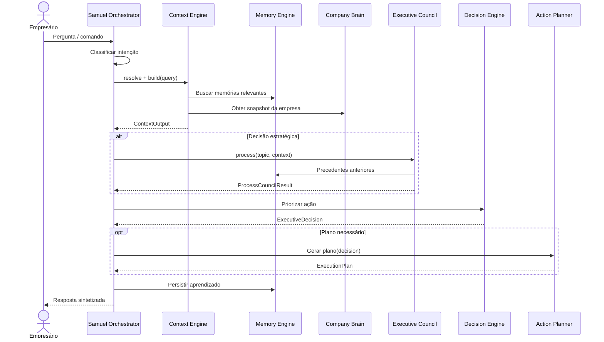
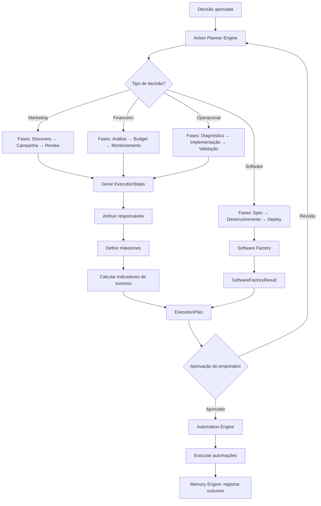
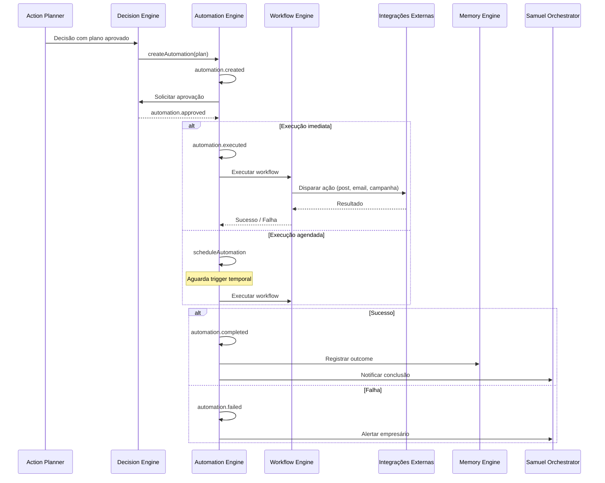

# Supercérebro — Arquitetura Oficial

Version: 1.0  
Date: July 2026

---

## Visão geral

O **Supercérebro** é a camada de inteligência central do SF Growth AI. Ele transforma dados de negócio, memória histórica e contexto operacional em decisões, planos e execuções automatizadas.

O Supercérebro **não é um chatbot**. É um sistema operacional de crescimento empresarial composto por engines especializados que cooperam em ciclos contínuos de **entender → decidir → executar → aprender**.

```
                         ┌─────────────────────┐
                         │  Samuel Orchestrator │
                         └──────────┬──────────┘
                                    │
              ┌─────────────────────┼─────────────────────┐
              ▼                     ▼                     ▼
      Context Engine         Memory Engine        Company Brain
              │                     │                     │
              └──────────┬──────────┴──────────┬──────────┘
                         ▼                     ▼
               Executive Council         Decision Engine
                         │                     │
                         └──────────┬──────────┘
                                    ▼
                          Action Planner Engine
                                    │
                         ┌──────────┴──────────┐
                         ▼                     ▼
                Automation Engine      Software Factory
                         │
                         ▼
                   Agency Brain (futuro)
```

---

## Princípios arquiteturais

1. **Separação de responsabilidades** — Cada engine tem um contrato claro; nenhum módulo faz tudo.
2. **Contexto antes de IA** — Dados estruturados (Context + Memory) alimentam qualquer raciocínio futuro.
3. **Decisão antes de execução** — Nenhuma automação roda sem passar pelo Decision Engine.
4. **Aprendizado contínuo** — Toda interação gera memória para o próximo ciclo.
5. **Multi-tenant** — Toda operação é isolada por `tenantId` + `companyId`.

---

# 1. Samuel Orchestrator

## Responsabilidade

Coordenar o fluxo completo de inteligência executiva. O Samuel Orchestrator é a **porta de entrada** do Supercérebro: recebe a pergunta ou comando do usuário, classifica a intenção, aciona os engines necessários e sintetiza a resposta final.

## Entradas

| Input | Descrição |
|-------|-----------|
| `userQuery` | Pergunta ou comando do empresário |
| `tenantId` / `companyId` | Escopo multi-tenant |
| `sessionId` | Identificador da conversa atual |
| `ExecutiveContext` | Contexto executivo pré-carregado (CRM, financeiro, marketing) |

## Saídas

| Output | Descrição |
|--------|-----------|
| `OrchestratorResult` | Resposta sintetizada com fases, confiança e ações |
| `OrchestratorSnapshot` | Estado do pipeline de análise |
| `ExecutiveActionPlan` | Plano de ação quando aplicável |
| `ConsultedExecutive[]` | Executivos consultados e suas opiniões |

## Dependências

- Context Engine — monta contexto da empresa
- Memory Engine — recupera histórico e aprendizados
- Executive Council Engine — debates multi-executivo
- Decision Engine — prioriza próxima ação
- Action Planner Engine — detalha plano de execução
- Company Brain — snapshot do estado do negócio

## Fluxo

1. Recebe query do usuário.
2. Classifica intenção (`QueryIntent`: sales, marketing, growth, finance, etc.).
3. Solicita contexto ao Context Engine.
4. Consulta Memory Engine por precedentes.
5. Aciona Executive Council quando a decisão é estratégica.
6. Delega ao Decision Engine para priorização.
7. Solicita plano ao Action Planner quando necessário.
8. Sintetiza resposta e persiste aprendizado no Memory Engine.

## Eventos

| Evento | Quando |
|--------|--------|
| `orchestrator.started` | Query recebida |
| `orchestrator.intent-classified` | Intenção identificada |
| `orchestrator.executives-consulted` | Conselho acionado |
| `orchestrator.decision-made` | Decisão tomada |
| `orchestrator.completed` | Resposta entregue |

## Futuras integrações

- LLM para síntese natural de respostas
- Streaming de resposta em tempo real
- Integração com Reasoning Engine
- Voice interface (Samuel por voz)

**Código de referência:** `features/samuel-ai/services/executive-orchestrator.service.ts`, `executive-conversation-orchestrator.service.ts`

---

# 2. Memory Engine

## Responsabilidade

Armazenar, organizar, recuperar e resumir todo o conhecimento de cada empresa. O Memory Engine garante que o Supercérebro **nunca comece do zero**.

## Entradas

| Input | Descrição |
|-------|-----------|
| `MemoryInput` | Nova memória (title, content, type, importance, tags) |
| `MemorySearch` | Critérios de busca (query, types, tags, importance) |
| `MemoryUpdateInput` | Atualização de memória existente |

## Saídas

| Output | Descrição |
|--------|-----------|
| `Memory` | Registro persistido |
| `MemorySearchResult[]` | Resultados ranqueados |
| `MemorySummary` | Agregação por tipo, importância e tags |
| `Memory[]` (rank) | Memórias priorizadas |

## Dependências

- `MemoryRepository` (contrato — Supabase futuro)
- Consumido por: Context Engine, Samuel Orchestrator, Company Brain, Executive Council

## Fluxo

```
Consumer → MemoryService → Repository / Search / Ranking / Summary → Supabase (futuro)
```

Operações: `create`, `update`, `delete`, `findById`, `search`, `listByCompany`, `summarize`, `rank`.

## Eventos

| Evento | Quando |
|--------|--------|
| `memory.created` | Nova memória registrada |
| `memory.updated` | Memória atualizada |
| `memory.deleted` | Memória removida |
| `memory.searched` | Busca executada |

## Futuras integrações

- Supabase como backend de persistência
- Embeddings e busca semântica (vector search)
- Resumo com LLM
- Sincronização com `enterprise-memory-runtime`

**Código de referência:** `apps/web/src/core/memory/`  
**Documentação:** `docs/02-engines/MEMORY_ENGINE.md`

---

# 3. Context Engine

## Responsabilidade

Transformar dados brutos de múltiplas fontes em contexto estruturado e priorizado para o Samuel e demais engines. Ponte entre dados operacionais e raciocínio executivo.

## Entradas

| Input | Descrição |
|-------|-----------|
| `ContextInput` | tenantId, companyId, query, sources, limit, since |
| `ContextSourceProvider[]` | Providers de cada fonte de dados |

## Saídas

| Output | Descrição |
|--------|-----------|
| `Context` | Contexto montado com fragmentos |
| `ContextOutput` | Context + summary + timeline + prioritized |
| `ContextResolveResult` | Fontes resolvidas para a query |
| `ContextTimelineEntry[]` | Sequência cronológica |

## Dependências

- Memory Engine (fonte MEMORY)
- Company Brain (fonte COMPANY_BRAIN)
- CRM, Agenda, Financeiro, Marketing (fontes futuras)
- Consumido por: Samuel Orchestrator, Executive Council, Decision Engine

## Fluxo

```
Input → resolve() → build() → prioritize() / timeline() / summarize() → ContextOutput
```

Fontes suportadas: MEMORY, COMPANY_BRAIN, PROJECTS, CLIENTS, AGENDA, FINANCIAL, MARKETING, DOCUMENTS, CONVERSATIONS, EXECUTIVE_COUNCIL.

## Eventos

| Evento | Quando |
|--------|--------|
| `context.resolved` | Fontes identificadas |
| `context.built` | Contexto montado |
| `context.merged` | Múltiplos contextos combinados |

## Futuras integrações

- `ContextSourceProvider` para cada módulo de dados
- Cache de contexto por sessão
- Resumo com LLM
- Indexação semântica via Memory Engine

**Código de referência:** `apps/web/src/core/context/`  
**Documentação:** `docs/02-engines/CONTEXT_ENGINE.md`

---

# 4. Executive Council Engine

## Responsabilidade

Orquestrar debates entre executivos digitais (CMO, CFO, COO, CSO, etc.) para decisões que exigem múltiplas perspectivas. O Conselho **nunca deixa o Samuel decidir sozinho** em assuntos estratégicos.

## Entradas

| Input | Descrição |
|-------|-----------|
| `ProcessCouncilInput` | Tópico, contexto, executivos convocados |
| `ContextOutput` | Contexto priorizado da empresa |
| `Memory[]` | Precedentes e decisões anteriores |

## Saídas

| Output | Descrição |
|--------|-----------|
| `ProcessCouncilResult` | Decisão consensual ou conflito documentado |
| `CouncilSession` | Sessão com opiniões individuais |
| `ExecutiveOpinion[]` | Parecer de cada executivo |

## Dependências

- Context Engine — briefing da sessão
- Memory Engine — histórico de decisões
- Company Brain — estado atual do negócio
- Consumido por: Samuel Orchestrator, Decision Engine

## Fluxo

1. Samuel convoca sessão com tópico e contexto.
2. Executivos relevantes são convidados.
3. Cada executivo submete opinião baseada em sua área.
4. Engine detecta consenso ou conflito.
5. Decisão final é registrada no Memory Engine.

## Eventos

| Evento | Quando |
|--------|--------|
| `council.session-started` | Sessão iniciada |
| `council.member-invited` | Executivo convocado |
| `council.opinion-submitted` | Opinião registrada |
| `council.consensus-reached` | Consenso alcançado |
| `council.conflict-detected` | Conflito entre executivos |
| `council.decision-completed` | Decisão final registrada |

## Futuras integrações

- LLM para geração de opiniões por executivo
- Votação ponderada por área de impacto
- Integração com Growth Score para priorização
- Replay de sessões para auditoria

**Código de referência:** `core/executive-council/`

---

# 5. Decision Engine

## Responsabilidade

Escolher a **próxima melhor ação** com base em contexto, inteligência e parecer do Conselho. Transforma análise em decisão concreta com prioridade, impacto e prazo.

## Entradas

| Input | Descrição |
|-------|-----------|
| `ExecutiveIntelligence` | Análise de forças, fraquezas, riscos e oportunidades |
| `ContextOutput` | Contexto priorizado |
| `ProcessCouncilResult` | Decisão ou consenso do Conselho |
| `GrowthScore` | Score de maturidade (futuro) |

## Saídas

| Output | Descrição |
|--------|-----------|
| `ExecutiveDecision` | Decisão com prioridade, impacto, dificuldade, ROI |
| `ExecutiveDecision[]` | Lista priorizada de decisões |

## Dependências

- Context Engine
- Memory Engine
- Executive Council Engine
- Company Brain
- Consumido por: Action Planner Engine, Samuel Orchestrator

## Fluxo

1. Recebe inteligência e contexto.
2. Aplica regras de decisão por padrões detectados (fraquezas, riscos, oportunidades).
3. Classifica por prioridade (Critical → Low).
4. Estima impacto, dificuldade e ROI.
5. Retorna decisão(ões) ranqueadas.

## Eventos

| Evento | Quando |
|--------|--------|
| `decision.generated` | Nova decisão criada |
| `decision.prioritized` | Decisões ranqueadas |
| `decision.approved` | Decisão aprovada pelo empresário |

## Futuras integrações

- LLM para raciocínio sobre trade-offs
- Integração com Opportunity Engine
- Simulação de cenários (what-if)
- Feedback loop com Growth Score

**Código de referência:** `features/samuel-ai/services/executive-decision.service.ts`

---

# 6. Action Planner Engine

## Responsabilidade

Transformar decisões em **planos de execução detalhados** com fases, etapas, responsáveis, prazos e indicadores de sucesso.

## Entradas

| Input | Descrição |
|-------|-----------|
| `ExecutiveDecision` | Decisão a ser executada |
| `ContextOutput` | Contexto operacional |
| `companyProfile` | Perfil e capacidade da empresa |

## Saídas

| Output | Descrição |
|--------|-----------|
| `ExecutionPlan` | Plano com fases, steps, milestones |
| `ExecutionPhase[]` | Fases ordenadas |
| `ExecutionStep[]` | Etapas com responsável e deadline |

## Dependências

- Decision Engine — decisão de origem
- Context Engine — contexto operacional
- Consumido por: Automation Engine, Software Factory, Samuel Orchestrator

## Fluxo

1. Recebe decisão aprovada.
2. Decompõe em fases (Discovery → Planning → Execution → Review).
3. Gera steps com responsável por departamento.
4. Define milestones e indicadores de sucesso.
5. Calcula progresso e status.

## Eventos

| Evento | Quando |
|--------|--------|
| `plan.created` | Plano gerado |
| `plan.phase-started` | Fase iniciada |
| `plan.step-completed` | Etapa concluída |
| `plan.completed` | Plano finalizado |

## Futuras integrações

- LLM para geração de steps contextuais
- Integração com CRM para atribuição de tarefas
- Timeline visual no workspace
- Aprovação do empresário antes de execução

**Código de referência:** `features/samuel-ai/services/executive-execution-planner.service.ts`

---

# 7. Automation Engine

## Responsabilidade

Executar ações automatizadas derivadas de planos aprovados: campanhas, posts, emails, relatórios, workflows recorrentes.

## Entradas

| Input | Descrição |
|-------|-----------|
| `CreateAutomationDto` | Definição da automação |
| `ExecuteAutomationDto` | Comando de execução |
| `ScheduleAutomationDto` | Agendamento |
| `ExecutionPlan` | Plano de origem (via Action Planner) |

## Saídas

| Output | Descrição |
|--------|-----------|
| `Automation` | Automação criada/agendada |
| `AutomationResult` | Resultado da execução |
| `Workflow` | Workflow configurado |

## Dependências

- Action Planner Engine — plano de origem
- Decision Engine — aprovação prévia
- Integrações externas (Meta, Google, email — futuro)
- Consumido por: Samuel Orchestrator (status de execução)

## Fluxo

1. Recebe automação derivada de plano ou decisão.
2. Valida aprovação (`approveAutomation`).
3. Agenda ou executa imediatamente.
4. Monitora execução e captura resultado.
5. Registra outcome no Memory Engine.

## Eventos

| Evento | Quando |
|--------|--------|
| `automation.created` | Automação criada |
| `automation.approved` | Automação aprovada |
| `automation.executed` | Execução iniciada |
| `automation.completed` | Execução concluída |
| `automation.failed` | Falha na execução |
| `automation.cancelled` | Automação cancelada |

## Futuras integrações

- Conectores Meta Ads, Google Ads, email marketing
- Webhooks para sistemas externos
- Retry e dead-letter queue
- Dashboard de automações ativas

**Código de referência:** `core/business-automation/`

---

# 8. Company Brain

## Responsabilidade

Manter a **identidade digital viva** de cada empresa: Business Twin (estado atual) + Business DNA (personalidade e valores). Fonte de verdade sobre quem a empresa é e como opera.

## Entradas

| Input | Descrição |
|-------|-----------|
| `organizationId` / `companyId` | Escopo |
| Dados de onboarding | Perfil, serviços, produtos, clientes |
| Atualizações operacionais | CRM, financeiro, marketing |

## Saídas

| Output | Descrição |
|--------|-----------|
| `BrainSnapshot` | Snapshot completo do estado |
| `BrainContext` | Contexto estruturado para engines |
| `HealthAnalysis` | Análise de saúde do negócio |
| `RelationshipMap` | Mapa de relações entre entidades |

## Dependências

- Supabase (dados de empresa)
- Memory Engine — persistência de mudanças
- Consumido por: Context Engine, Samuel Orchestrator, Executive Council, Decision Engine

## Fluxo

1. Coleta dados de múltiplas fontes (onboarding, CRM, integrações).
2. Monta snapshot do Business Twin.
3. Enriquece com Business DNA (missão, valores, tom de voz).
4. Analisa saúde e relacionamentos.
5. Expõe contexto via Context Engine.

## Eventos

| Evento | Quando |
|--------|--------|
| `brain.snapshot-built` | Snapshot gerado |
| `brain.context-built` | Contexto montado |
| `brain.health-analyzed` | Análise de saúde concluída |
| `brain.profile-updated` | Perfil atualizado |

## Futuras integrações

- Sincronização bidirecional com CRM
- Research Engine para enriquecimento externo
- Growth Score como dimensão de saúde
- Business DNA com LLM para inferência de personalidade

**Código de referência:** `core/enterprise-brain-runtime/`  
**Documentação:** `docs/04-ai/BUSINESS_TWIN.md`, `docs/04-ai/BUSINESS_DNA.md`

---

# 9. Agency Brain (futuro)

## Responsabilidade

Inteligência central da **agência** que gerencia múltiplas empresas clientes. Agrega visão cross-client, benchmarks de mercado e capacidade operacional da agência.

## Entradas

| Input | Descrição |
|-------|-----------|
| `agencyId` | Identificador da agência |
| `CompanyBrain[]` | Snapshots de todos os clientes |
| Métricas de portfólio | Performance agregada |

## Saídas

| Output | Descrição |
|--------|-----------|
| `AgencySnapshot` | Visão consolidada da agência |
| `ClientBenchmark` | Comparativo entre clientes |
| `CapacityPlan` | Capacidade operacional disponível |

## Dependências

- Company Brain (por cliente)
- Memory Engine (memória cross-client)
- Agency Core (`core/agency-core/` — parcialmente implementado)

## Fluxo

1. Agrega snapshots de todos os clientes da agência.
2. Calcula benchmarks e tendências de portfólio.
3. Identifica clientes em risco ou com oportunidade.
4. Aloca capacidade operacional da agência.
5. Fornece visão ao workspace da agência.

## Eventos

| Evento | Quando |
|--------|--------|
| `agency.snapshot-built` | Snapshot da agência gerado |
| `agency.client-onboarded` | Novo cliente integrado |
| `agency.benchmark-updated` | Benchmark recalculado |

## Futuras integrações

- Dashboard multi-client no Agency Workspace
- Alocação inteligente de equipe
- Benchmark anônimo entre clientes do mesmo segmento
- Relatórios executivos para donos de agência

**Status:** Planejado — `core/agency-core/` contém fundação parcial.

---

# 10. Software Factory

## Responsabilidade

Gerar **software sob demanda** quando o plano de ação exige ferramentas, landing pages, dashboards ou integrações que não existem na plataforma.

## Entradas

| Input | Descrição |
|-------|-----------|
| `RequestSoftwareInput` | Requisito de software |
| `ExecutionPlan` | Plano que originou a necessidade |
| `ApproveSoftwareProjectInput` | Aprovação do empresário |

## Saídas

| Output | Descrição |
|--------|-----------|
| `SoftwareFactoryResult` | Projeto gerado com arquitetura |
| `SoftwareProject` | Especificação do projeto |
| Artefatos | Código, landing pages, dashboards |

## Dependências

- Action Planner Engine — plano de origem
- Decision Engine — aprovação
- AI Provider (futuro) — geração de código
- Consumido por: Automation Engine (deploy de artefatos)

## Fluxo

1. Action Planner identifica necessidade de software.
2. Software Factory recebe requisito e gera especificação.
3. Empresário aprova projeto.
4. Factory gera arquitetura e artefatos.
5. Automação faz deploy e registra no Memory Engine.

## Eventos

| Evento | Quando |
|--------|--------|
| `software.requested` | Requisição recebida |
| `software.approved` | Projeto aprovado |
| `software.generated` | Artefatos gerados |
| `software.deployed` | Deploy concluído |

## Futuras integrações

- LLM para geração de código (via AI Provider)
- CI/CD pipeline automático
- Preview antes de deploy
- Versionamento de projetos gerados

**Código de referência:** `core/software-factory/`

---

# Diagramas de fluxo

## Fluxo de uma pergunta do usuário



## Fluxo de criação de um plano



## Fluxo de execução de automações



---

# Mapa de dependências

```mermaid
graph LR
    SO[Samuel Orchestrator] --> CE[Context Engine]
    SO --> ME[Memory Engine]
    SO --> EC[Executive Council]
    SO --> DE[Decision Engine]
    SO --> AP[Action Planner]

    CE --> ME
    CE --> CB[Company Brain]

    EC --> CE
    EC --> ME
    EC --> CB

    DE --> CE
    DE --> EC
    DE --> ME

    AP --> DE
    AP --> CE

    AE[Automation Engine] --> AP
    AE --> DE

    SF[Software Factory] --> AP
    SF --> DE

    AB[Agency Brain] -.-> CB
    AB -.-> ME

    style AB fill:#333,stroke:#666,stroke-dasharray: 5 5
```



> Linha tracejada = módulo futuro (Agency Brain)

---

# Ciclo de aprendizado contínuo

```
Entender → Decidir → Executar → Aprender → Entender ...
     ↑                                        │
     └──────────── Memory Engine ←────────────┘
```

Cada ciclo enriquece o Memory Engine, que alimenta o Context Engine no ciclo seguinte. O Supercérebro fica mais inteligente a cada interação — mesmo sem LLM, a arquitetura garante acumulação estruturada de conhecimento.

---

# Referências

| Documento | Conteúdo |
|-----------|----------|
| `docs/02-engines/MEMORY_ENGINE.md` | Memory Engine detalhado |
| `docs/02-engines/CONTEXT_ENGINE.md` | Context Engine detalhado |
| `docs/00-master/SF_GROWTH_AI_MASTER_ARCHITECTURE.md` | Arquitetura master |
| `docs/03-architecture/SF_GROWTH_AI_ARCHITECTURE_V1.md` | Arquitetura V1 |
| `docs/01-brain/SF_GROWTH_AI_EXECUTIVE_BRAIN.md` | Executive Brain |
| `docs/04-ai/BUSINESS_TWIN.md` | Business Twin |
| `docs/04-ai/BUSINESS_DNA.md` | Business DNA |
